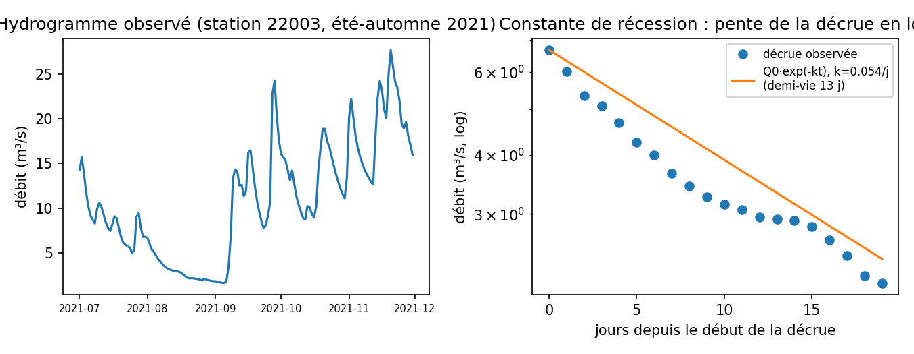
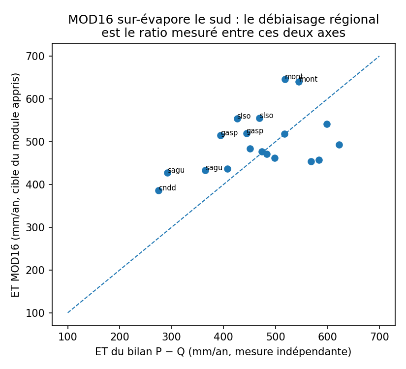
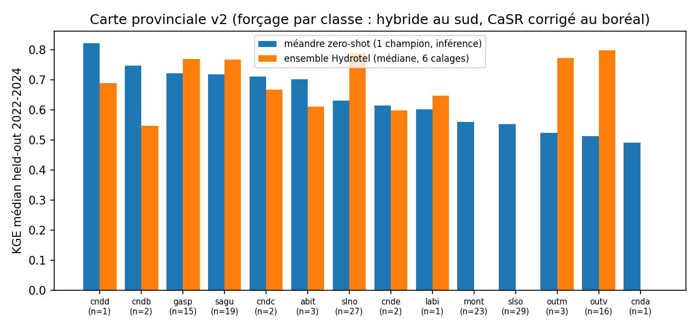

```{python}
#| label: setup
#| include: false
import os
os.chdir("C:/Users/parse01/documents-locaux/GitHub/meandre")
from pathlib import Path
import numpy as np
import pandas as pd
import duckdb
import matplotlib.pyplot as plt
import matplotlib.dates as mdates
from matplotlib.collections import LineCollection

plt.rcParams.update({
    "figure.dpi": 120, "font.size": 10, "axes.grid": True, "grid.alpha": 0.25,
})

DB = ".runs/slso/data/slso.duckdb"
CACHE_PHEN = ".runs/slso/data/cache_phenology_no_gru.npz"
CACHE_MAPS = ".runs/slso/data/cache_maps.npz"

def kge(sim, obs):
    """KGE de Gupta et al. (2009). NaN si moins de 30 paires valides."""
    m = ~np.isnan(obs) & ~np.isnan(sim)
    if m.sum() < 30:
        return np.nan
    s, o = sim[m], obs[m]
    r = np.corrcoef(s, o)[0, 1]
    alpha = s.std() / o.std()
    beta = s.mean() / o.mean()
    return 1.0 - np.sqrt((r - 1) ** 2 + (alpha - 1) ** 2 + (beta - 1) ** 2)

phen = dict(np.load(CACHE_PHEN, allow_pickle=True))
maps = dict(np.load(CACHE_MAPS, allow_pickle=True)) if Path(CACHE_MAPS).exists() else None
```

# Résumé {.unnumbered}

`meandre` est une réimplémentation différentiable du modèle hydrologique distribué Hydrotel [@fortin2001] en PyTorch. La chaîne de processus verticaux d'Hydrotel (neige, gel du sol, interception, évapotranspiration, sol à trois couches, milieux humides, aquifère) et le routage hydraulique Muskingum-Cunge [@cunge1969] sur le réseau de tronçons sont conservés. Chaque équation étant dérivable, la calibration peut être effectuée par descente de gradient sur l'ensemble des paramètres physiques par un encodeur spatio-temporel qui apprend une fonction continue des coordonnées, des descripteurs territoriaux et des régressions saisonnières simples. Une tête probabiliste optionnelle, branchée en bout de chaîne et calibrée empiriquement, prédit le débit sous forme de distributions.

```{python}
#| label: resume-metrics
#| echo: false
test = phen["test_mask"]
Qs, qo = phen["Q_sim"], phen["q_obs"]
kge_test_pool = kge(Qs[test].ravel(), qo[test].ravel())
per_test = np.array([kge(Qs[test, i], qo[test, i]) for i in range(Qs.shape[1])])
n_valid = np.isfinite(per_test).sum()
n_ok = int((per_test > 0.5).sum())
from IPython.display import Markdown
Markdown(
    f"Sur le bassin Saint-Laurent-Sud-Ouest (SLSO), évalué sur la période test "
    f"2022-2024, jamais vue à l'entraînement, `meandre` atteint un KGE poolé de "
    f"{kge_test_pool:.2f}, avec {n_ok}/{n_valid} stations au-dessus de 0,5. "
    f"La tête probabiliste atteint une couverture de l'intervalle à 90 % proche de sa "
    f"valeur nominale (§ -@sec-proba)."
)
```

Ce document décrit l'architecture, la procédure de calibration, les résultats sur SLSO (cartes de paramètres, cartes de performance, hydrogrammes), l'historique des essais (réussites comme échecs) et la trajectoire de mise à l'échelle vers le Québec.

# Contexte
Les modèles hydrologiques opérationnels québécois (Hydrotel, MOHYSE, GR4J, HSAMI, HBV) reposent sur des paramètres calibrés bassin par bassin avec leur optimiseur dédié. Cette approche présente des limites :

- les implémentations compilées (C++, Fortran) sont peu accessibles et peu extensibles : ajouter un module de thermie ou une contrainte auxiliaire comme l'évapotranspiration satellitaire demande un travail d'ingénierie disproportionné ;
- les optimisations globales sont sujettes à la compensation entre paramètres (équifinalité), où des jeux de paramètres très différents produisent des débits semblables, ce qui rend les analyses de scénario peu fiables (que se passerait-il si les prélèvements étaient nuls, ou si l'occupation du sol changeait ?) ;
- la quantification de l'incertitude exige de construire des ensembles de simulations ;
- le calage est lent ;
- les modèles physiques sont spécialisés, et demande une dépendance technologique.

La différentiation automatique, implémentée en Pytorch, lève les contraintes numériques. Là où chaque équation est différentiable, la calibration identifie les paramètres nécessitant un ajustement pour améliorer un indicateur de performance pouvant cibler spécifiquement les crues, les étiages, ou un compromis établi par l'objectif de la modélisation. Quant aux modèles physiques, les API modernes permettent d'assembler les données nécessaires à partir de données publiques.

# Architecture
## Intrants
`meandre` comprend 25 paramètres fixes sous forme de descripteurs territoriaux (@tbl-descriptors), enchâssés dans la table `territorial` d'une base de donnée descriptive placée dans `data/basin.duckdb`, et 36 paramètres ajustables essentiels à la modélisation (@tbl-params). L'architecture utilise les descripteurs territoriaux pour la modélisation et pour aider à la prédiction des paramètres de modélisation. L'hydraulique du sol issue de SoilGrids (porosité, capacités, K_sat) sert d'entrée informative au réseau, distincte des mêmes propriétés optimisées par couche en sortie.

```{python}
#| label: tbl-descriptors
#| tbl-cap: "Les 25 descripteurs territoriaux (entrées fixes de l'encodeur spatial) et leur source, assemblés à partir de données ouvertes."
descr = [
    ("Topographie", "surface drainée, ordre de Strahler, pente moyenne, altitude moyenne, exposition (sin/cos de l'aspect)", "Copernicus DEM 30 m (D8)"),
    ("Occupation du sol", "forêt (totale, conifère, feuillu, mixte), agriculture, urbain, milieux humides, tourbières, eau libre", "ESA WorldCover (NRCan en complément)"),
    ("Texture du sol", "sable, silt, argile", "SoilGrids"),
    ("Hydraulique du sol (entrée)", "porosité, capacité au champ, point de flétrissement, K_sat", "SoilGrids (pédotransfert)"),
    ("Végétation", "indice de surface foliaire (LAI) moyen", "MODIS LAI"),
    ("Hydrographie", "distance à l'exutoire, fraction lacustre", "Copernicus DEM (D8) et Joint Research Center pour l'eau de surface"),
]
pd.DataFrame(descr, columns=["Catégorie", "Descripteurs", "Source"])
```

```{python}
#| label: tbl-params
#| tbl-cap: "Paramètres du modèle : optimisés par l'encodeur spatial (38, dont les paramètres de lac) et le modulateur phénologique (4), puis entrées fixes avec leur source open data."
rows = [
    # Paramètres optimisés (appris par descente de gradient)
    ("Sol : hydraulique", "K_sat, porosité, θ_fc, θ_wp, n (van Genuchten)", "Optimisé", "appris, init. Rawls 1982"),
    ("Sol : racines, épaisseurs", "f_root (×3), Z2, Z3", "Optimisé", "appris"),
    ("Drainage, aquifère", "f_vert (×3), k_gw, T_gw", "Optimisé", "appris"),
    ("Neige, gel", "C_f, T_melt, T_snow, frost_alpha", "Optimisé", "appris, init. Hock 2003"),
    ("ET, interception", "K_c, interception_capacity", "Optimisé", "appris, init. FAO-56"),
    ("Surface, milieux humides", "f_wetland, manning_n, rain_hours", "Optimisé", "appris"),
    ("Routage", "K_musk_hours, x_musk", "Optimisé", "appris"),
    ("Lacs (tarage)", "k_lake, beta", "Optimisé", "appris par nœud (NeRF)"),
    ("Thermie", "K_atm, alpha_T", "Optimisé", "appris"),
    ("Phénologie (modulateur)", "GDD_emerg, GDD_mid, K_c_min, K_c_maxFactor", "Optimisé", "appris, init. boréal"),
    # Entrées fixes (données, non optimisées)
    ("Descripteurs territoriaux (25)", "topographie, occupation du sol, texture, hydraulique du sol, LAI, hydrographie (voir tbl-descriptors)", "Fixe (entrée NeRF)", "Copernicus DEM, ESA WorldCover, SoilGrids, MODIS LAI, JRC"),
    ("Réseau et géométrie", "topologie, longueurs de tronçon, surfaces drainées", "Fixe", "D8 sur Copernicus DEM 30 m"),
    ("Couche de surface", "épaisseur Z1 = 0,30 m", "Fixe", "littérature"),
    ("Forçage météo", "P, T (grille Québec) ; R_n, vent, humidité (dérivés)", "Fixe (entrée)", "grille interne Québec (SIMAT)"),
    ("Prélèvements, rejets", "net_W par tronçon", "Fixe (entrée)", "BCDPE"),
    ("Constantes numériques", "clamp ψ = −100 m, sous-pas Muskingum, structure 3 couches", "Fixe", "fixées (stabilité)"),
]
pd.DataFrame(rows, columns=["Catégorie", "Paramètres / variables", "Statut", "Source"])
```

Les variables météorologiques sont quant à elles consignées dans une matrice netCDF comprenant les précipitations cumulées, les températures minimum et maximum, le rayonnement net, la vitesse du vent et pression de vapeur (humidité). `meandre` possède les équations nécessaires pour se contenter des précipitations et des températures.

Un modèle physique permet à un modélisateur, comme `meandre`, de recevoir les forçage météo. `meandre` comprend un importateur Physitel (modèle physique d'Hydrotel), mais ce dernier ne s'étant pas montré optimal, les efforts ont été réalignés sur un importateur de données publiques (mode *open data*). En effet, les API modernes permettent d'assembler les données nécessaires à partir de différentes sources publiques, comme la NASA, Planetary Computer (Microsoft) et Copernicus. L'hydrologie demandant des données de précipitation de grande qualité, seules ces dernières doivent, pour l'instant, être issues de données internes du gouvernement du Québec (données SIMAT).

## Vue d'ensemble
`meandre` reprend la structure d'Hydrotel, qui transforme des forçages météorologiques en débits, en passant par une colonne de sol verticale puis un routage sur le réseau hydrographique. La @fig-archi en donne le schéma. Les blocs physiques (bleu) implémentent les équations d'Hydrotel ; les blocs neuronaux (violet) produisent les paramètres de ces équations et la distribution prédictive.

![Chaîne de traitement de `meandre`. Le paysage (vert) alimente l'encodeur spatial (violet) qui paramétrise la colonne verticale physique (bleu), forcée par la météo. Les indices hydrométéorologiques (IHI) calculés à partir de la météo modulent K_c via le modulateur phénologique et servent de features à la tête probabiliste. Les apports latéraux, les prélèvements et rejets sont routés sur le réseau (orange) pour produire le débit simulé et la température de l'eau (jaune), le débit étant transformé en distribution prédictive par la tête probabiliste. Les observations (débit, ET, TWS) entrent dans la fonction de perte (rouge).](fig-archi.svg){#fig-archi}

## Encodeur spatial {#sec-encodeur}
L'encodeur spatial est un perceptron multicouche (MLP) de type neural radiance field (NeRF) qui transforme la position et les 25 descripteurs territoriaux d'un tronçon (@tbl-descriptors) en un vecteur de 36 paramètres hydrologiques (@tbl-params). Formellement, il calcule la composition

$$
(\text{lon}, \text{lat}, \mathbf{x}_{\text{terr}})
\;\xrightarrow{\ \gamma\ }\; \mathbb{R}^{d_\gamma}
\;\xrightarrow{\ \text{MLP}\ }\; \mathbb{R}^{36}
\;\xrightarrow{\ \phi\ }\; \theta,
$$ {#eq-encoder}

où $\mathbf{x}_{\text{terr}}$ est le vecteur des 25 descripteurs territoriaux du tronçon, $\gamma$ est l'encodage positionnel de Fourier, $d_\gamma$ la dimension de cet encodage, et $\phi$ un ensemble de fonctions de borne appliquées composante par composante. Le vecteur de sortie $\theta \in \mathbb{R}^{36}$ contient les paramètres physiques optimisés ; sur les tronçons-lacs, une tête auxiliaire du même réseau produit en outre les deux paramètres de la courbe de tarage ($k$, $\beta$), portant à 38 le nombre total de paramètres appris par l'encodeur. Le @tbl-params distingue ces paramètres optimisés des entrées fixes du modèle (descripteurs, forçage, topologie) et indique la source de chaque entrée fixe.

Les surfaces physiques des tronçons (surface drainée et surface locale, en km²) ne sont pas des entrées de l'encodeur : elles servent directement aux conversions d'unités du routage et des prélèvements. Les épaisseurs de sol ne sont pas non plus issues du roc : la couche de surface Z1 est fixée à 0,30 m, et les épaisseurs Z2 et Z3 sont des paramètres appris par l'encodeur. Le schéma de données prévoit une profondeur jusqu'au roc (proxy SoilGrids disponible), mais elle n'est pas encore câblée et n'intervient donc pas dans le modèle.

L'encodage de Fourier $\gamma$ projette les coordonnées sur une base de sinus et cosinus à plusieurs fréquences [@tancik2020 ; @mildenhall2020]. Sans cet encodage, un MLP de profondeur modeste produit une fonction trop lisse pour reproduire des variations spatiales fines ; l'encodage de Fourier permet de représenter ces hautes fréquences sans empiler de couches supplémentaires. Les fonctions de borne $\phi$ (sigmoïde rééchelonnée pour les paramètres à intervalle fermé, softplus plafonnée pour les paramètres positifs) garantissent que chaque sortie reste dans son intervalle physiquement plausible, par exemple $K_{\text{sat}} \in [10^{-5}, 10^{-3}]\ \text{m·s}^{-1}$, $C_f \in [1, 10]\ \text{mm·°C}^{-1}\text{·j}^{-1}$, $K_c \in [0{,}3 ; 1{,}5]$.

La couche de sortie est initialisée de sorte que les paramètres démarrent aux valeurs de la littérature pour une forêt boréale sur loam silteux : @rawls1982 pour l'hydraulique du sol, @hock2003 pour la fonte nivale, @allen1998 pour l'évapotranspiration. Sans cette initialisation, $K_{\text{sat}}$ démarre à des valeurs 50x trop élevées, et la convergence est lente.

Le point essentiel est que l'encodeur n'apprend pas 36 paramètres indépendants par tronçon, mais une seule fonction continue $(\text{lon}, \text{lat}, \mathbf{x}_{\text{terr}}) \mapsto \theta$. C'est cette régression spatiale qui permet le partage d'information entre tronçons et bassins voisins.

## Colonne verticale {#sec-colonne}
À chaque pas de temps quotidien, tous les tronçons exécutent en parallèle (vectorisés sur les noeuds) la même séquence d'équations.

### Neige et gel
La fonte suit un modèle degré-jour avec teneur en froid qui amortit la fonte précoce :

$$
M = \min\!\bigl(C_f \cdot \max(T - T_{\text{melt}},\, 0),\ \text{SWE}\bigr),
$$ {#eq-melt}

où $M$ est la fonte journalière [mm], $C_f$ le facteur degré-jour [mm·°C⁻¹·j⁻¹], $T$ la température de l'air [°C], $T_{\text{melt}}$ le seuil de fonte [°C] et SWE l'équivalent en eau de la neige disponible [mm]. Un coefficient de gel $\alpha_{\text{frost}} \in [0, 1]$ réduit la conductivité hydraulique selon la température du sol intégrée :

$$
K_{\text{sat,eff}} = K_{\text{sat}}\,\bigl(1 - \alpha_{\text{frost}}\, f_{\text{gel}}(T_{\text{sol}})\bigr),
$$ {#eq-frost}

où $f_{\text{gel}} \in [0,1]$ croît avec l'intensité du gel du sol.

### Évapotranspiration

Mise à jour 2026-07 : la formulation fermée décrite ci-dessous est désormais remplacée, dans la recette canonique, par un module appris supervisé par MODIS (voir la section Stratégie, phase 1) ; la demande apprise entre dans la même extraction par couche bornée par l'eau disponible, la conservation de masse est donc inchangée.
L'évapotranspiration de référence $ET_0$ suit la formulation Penman-Monteith FAO-56 [@allen1998] :

$$
ET_0 = \frac{0{,}408\,\Delta\,(R_n - G) + \gamma\,\dfrac{900}{T + 273}\,u_2\,(e_s - e_a)}
            {\Delta + \gamma\,(1 + 0{,}34\,u_2)},
$$ {#eq-et}

où $ET_0$ est l'ET de référence [mm·j⁻¹], $\Delta$ la pente de la courbe de pression de vapeur saturante [kPa·°C⁻¹], $R_n$ le rayonnement net [MJ·m⁻²·j⁻¹], $G$ le flux de chaleur dans le sol [MJ·m⁻²·j⁻¹], $\gamma$ la constante psychrométrique [kPa·°C⁻¹], $u_2$ la vitesse du vent à 2 m [m·s⁻¹] et $(e_s - e_a)$ le déficit de pression de vapeur [kPa]. L'ET réelle vaut $ET = K_c \cdot ET_0$, plafonnée par l'eau disponible dans le sol, où le coefficient cultural $K_c$ est modulé par la phénologie (§ -@sec-modulation).

### Sol à trois couches (couche de surface fixée à 0,30 m ; épaisseurs des couches 2 et 3 apprises par l'encodeur, § -@sec-encodeur)
La rétention et la conductivité non saturée suivent le modèle de @vangenuchten1980 :

$$
\theta(\psi) = \theta_r + \frac{\theta_s - \theta_r}{\bigl[1 + (\alpha\,|\psi|)^n\bigr]^{1 - 1/n}},
\qquad
K(\theta) = K_{\text{sat}}\, S_e^{1/2}\,\Bigl[1 - \bigl(1 - S_e^{\,n/(n-1)}\bigr)^{1 - 1/n}\Bigr]^2,
$$ {#eq-vg}

où $\theta$ est la teneur en eau volumique [m³·m⁻³], $\psi$ le potentiel matriciel [m], $\theta_r$ et $\theta_s$ les teneurs résiduelle et à saturation, $\alpha$ [m⁻¹] et $n$ les paramètres de forme de van Genuchten, et $S_e = (\theta - \theta_r)/(\theta_s - \theta_r) \in [0, 1]$ la saturation effective. Le potentiel $\psi$ est borné à $-100$ m pour éviter l'explosion de $\mathrm{d}\psi/\mathrm{d}S_e$ quand $S_e \to 0$.

### Autres flux

Mise à jour 2026-07 : l'aquifère restituant par nœud (réservoir linéaire alimenté par la recharge profonde, constante de vidange k_gw apprise et ancrée sur les récessions mesurées) fait maintenant partie de la recette canonique ; il a résolu la fragilité au changement de régime climatique (voir Stratégie, phases 2-3).
Les flux suivants complètent la colonne : interception (réservoir de canopée vidé par évaporation directe), interflow (ruissellement latéral hypodermique fonction de la pente, de la saturation et de $K_{\text{sat},2}$), drainage profond (recharge de l'aquifère contrôlée par les coefficients $f_{\text{vert}}$), et wetland et aquifère (réservoirs tampons à dynamique linéaire). Les sorties latérales (ruissellement, interflow, débit de base) alimentent le routage.

## Modulation temporelle des paramètres {#sec-modulation}
Les paramètres produits par l'encodeur spatial sont des moyennes climatologiques par tronçon. Or plusieurs processus exigent une dépendance temporelle : le coefficient cultural $K_c$ doit suivre la phénologie de la végétation, le coefficient de gel doit suivre les conditions cumulées de froid, la conductivité macroporale peut dépendre de l'antécédent humide.

Dans le modèle actuel, un seul paramètre est effectivement modulé dans le temps : le coefficient cultural $K_c$, via les degrés-jours de croissance (GDD). L'ensemble des indices hydrométéorologiques interprétables (GDD, antecedent precipitation index, indice de gel, équivalent en eau de la neige) est par ailleurs calculé et sert de features à la tête probabiliste (§ -@sec-tete). Étendre la modulation à d'autres paramètres (coefficient de gel, conductivité macroporale) suivra le même patron : une fonction paramétrique apprenable à faible nombre de paramètres nommés et interprétables, conditionnée sur l'indice pertinent, en remplacement des sigmoïdes ad-hoc précédemment câblées en dur dans le code.

Le premier modulateur de cette famille est le `PhenologyModulator`, qui module $K_c$ par une double logistique sur les GDD à quatre paramètres apprenables : $\text{GDD}_{\text{emerg}}$ (seuil d'émergence printanière), $\text{GDD}_{\text{mid}}$ (mi-saison), $K_{c,\min}$ (plancher hivernal) et $K_{c,\text{maxFactor}}$ (amplificateur estival). Son entraînement et sa validation contre le NDVI satellitaire sont détaillés au § -@sec-identifiabilite.

## Routage {#sec-routage}
Le routage utilise Muskingum-Cunge [@cunge1969] en mode différentiable, avec sous-pas de temps. Sur chaque tronçon, le débit aval à l'instant $t$ s'écrit

$$
Q_{\text{out}}(t) = C_1\, Q_{\text{in}}(t) + C_2\, Q_{\text{in}}(t - \Delta t) + C_3\, Q_{\text{out}}(t - \Delta t),
$$ {#eq-musk}

où $Q_{\text{in}}$ et $Q_{\text{out}}$ sont les débits amont et aval [m³·s⁻¹] et $\Delta t$ le pas de temps. Les coefficients $C_1, C_2, C_3$ (de somme 1) sont fonction du temps de transit $K$ et du paramètre d'atténuation $x$ :

$$
C_1 = \frac{\Delta t - 2Kx}{2K(1-x) + \Delta t},\quad
C_2 = \frac{\Delta t + 2Kx}{2K(1-x) + \Delta t},\quad
C_3 = \frac{2K(1-x) - \Delta t}{2K(1-x) + \Delta t},
$$ {#eq-musk-coeffs}

avec $K \in [4, 48]$ h et $x \in [0{,}01 ; 0{,}49]$, tous deux produits par l'encodeur spatial. La borne supérieure de 48 h sur $K$ est une contrainte de stabilité numérique du schéma à sous-pas, pas un choix hydrologique : un grand lac, dont le temps de résidence se compte en semaines, ne peut donc pas être représenté par un simple tronçon Muskingum, ce qui justifie le traitement séparé des retenues décrit plus bas.

Comme les coefficients $C_1, C_2, C_3$ ne dépendent pas du temps, la propagation intra-journalière à travers le réseau est un système linéaire triangulaire inférieur $(I - C_1 A)\,\mathbf{Q}_{\text{out}} = \mathbf{b}(t)$, où $A$ est la matrice d'adjacence amont-aval. `meandre` exploite cette structure : l'opérateur $(I - C_1 A)^{-1}$ est factorisé une seule fois par simulation, puis chaque pas de temps se réduit à un produit matrice-vecteur, au lieu de parcourir séquentiellement les niveaux topologiques du graphe (tri de Kahn). Cette reformulation est exacte (débit et gradients identiques au parcours séquentiel) et accélère l'entraînement d'un facteur proche de trente, le routage cessant d'être le goulot de calcul.

Les retenues (lacs naturels, barrages) reçoivent un traitement séparé par un modèle de réservoir différentiable à courbe de tarage $Q = k\,(S/A)^{\beta} A$, dont les paramètres $k$ et $\beta$ sont eux aussi produits par l'encodeur spatial à partir des descripteurs du tronçon : chaque plan d'eau obtient ainsi sa propre relation stockage-débit, identifiée par descente de gradient. Une analyse de sensibilité confirme que ce stockage explicite est indispensable : le désactiver fait chuter le KGE de plus de 0,2 aux stations situées en aval de lacs. En mode données ouvertes, les lacs sont détectés objectivement par satellite (occurrence d'eau de surface du Joint Research Centre, § -@sec-intrants), ce qui évite les pseudo-lacs dessinés à la main hérités d'Hydrotel.

## Tête probabiliste {#sec-tete}
Une tête probabiliste transforme le débit déterministe $Q_{\text{sim}}(t, n)$ en distribution prédictive. Après plusieurs familles paramétriques infructueuses (§ -@sec-historique), l'architecture retenue est une régression quantile contextuelle [@koenker1978]. Sept quantiles cibles $\tau \in \{0{,}05 ; 0{,}10 ; 0{,}25 ; 0{,}50 ; 0{,}75 ; 0{,}90 ; 0{,}95\}$ sont prédits par un petit MLP recevant comme entrées le vecteur de caractéristiques $\mathbf{f} = \bigl(Q_{\text{sim}},\ \log(Q_{\text{sim}} + 1),\ \sin\tfrac{2\pi\,\text{doy}}{365},\ \cos\tfrac{2\pi\,\text{doy}}{365},\ \mathbf{i}_{\text{IHI}}\bigr)$, où $\mathbf{i}_{\text{IHI}}$ regroupe les indices hydrométéorologiques interprétables (degré-jours de croissance, indice de précipitation antécédente, indice standardisé de précipitation, indice de gel, équivalent en eau de la neige). Toutes les entrées de la tête sont des quantités physiquement nommées : aucun état latent appris n'y est injecté. La médiane est libre (elle peut corriger un biais systématique de $Q_{\text{sim}}$) et les quantiles supérieurs sont contraints à rester ordonnés par cumul d'exponentielles :

$$
q_\tau(t, n) = Q_{\text{sim}}(t, n) + \delta_{0{,}5}(\mathbf{f})
              + \sum_{i\,:\,\tau_i \le \tau,\ \tau_i > 0{,}5} \exp\bigl(\Delta_i(\mathbf{f})\bigr),
$$ {#eq-quantile}

où $\delta_{0{,}5}(\mathbf{f})$ est l'écart appris de la médiane par rapport à $Q_{\text{sim}}$, et chaque $\Delta_i(\mathbf{f})$ est l'incrément (positif via l'exponentielle) entre quantiles successifs, ce qui garantit la monotonie $q_{\tau_1} \le q_{\tau_2}$ pour $\tau_1 \le \tau_2$. La perte est la somme des pinball losses sur les sept quantiles. L'initialisation à zéro de la dernière couche fait démarrer la tête exactement sur $Q_{\text{sim}}$.

Les familles tentées avant d'arriver à la régression quantile, et écartées, sont :

- Gaussienne hétéroscédastique (μ et σ appris) : PIT bimodal, le modèle écrête les pics (peak-shaving structurel).
- Box-Cox : la couverture de l'intervalle à 90 % tombe à environ 70 %, distribution sous-dispersée.
- Student-t hétéroscédastique : le degré de liberté ν absorbe la dispersion, le PIT reste non uniforme.
- Mélange gaussien (mixture density, K = 10 puis 20) : les modes s'effondrent, calibration faible.
- Ensemble (paramètres bruités, dropout actif au test) : la variance entre membres ne reflète pas la distribution prédictive vraie.
- Discrepancy additive de Kennedy-O'Hagan [@kennedy2001] : décorative en ablation contrôlée, absorbée par la composante de dispersion.

Une famille à deux ou trois paramètres ne calibre pas simultanément les étiages et les pics, dont la forme de distribution résiduelle diffère trop. La régression quantile non paramétrique, avec médiane libre et caractéristiques contextuelles, est la première à produire un PIT proche de l'uniforme.

# Calibration et données
## Données
Les forçages météorologiques journaliers (précipitation, températures min/max, rayonnement net, humidité, vent) proviennent d'une grille interpolée à l'échelle du Québec. Un override par ERA5-Land (EarthDataHub, format ARCO Zarr) est branché mais utilisé seulement ponctuellement ; un biais d'environ +10 % sur le rayonnement net estival a été mesuré entre les deux sources.

Les observations de débit proviennent de la BDH du MELCCFP, croisées avec HYDAT. Les prélèvements et rejets proviennent de la reconstruction historique du projet DPEH-DEPESS. Les contraintes auxiliaires de la fonction de coût sont l'ETR MODIS (MOD16A2GF, 8 jours, 500 m), l'anomalie de stock total d'eau GRACE [@tapley2004] (mensuelle, ~300 km), et le NDVI MOD13A1 [@huete2002], ce dernier servant à la validation externe a posteriori (§ -@sec-identifiabilite) et n'entrant pas dans la perte.

## Procédure d'entraînement
L'entraînement procède en phases successives, chacune définie par un fichier de configuration TOML :

1. Démarrage à froid: encodeur spatial initialisé sur la littérature, perte sur le débit seul ($\text{KGE} + \text{log-MSE} + \text{PBIAS}$).
2. Multi-objectif: ajout des contraintes ET (MODIS) et TWS (GRACE) pour contraindre la composante verticale.
3. Pondération des pics: rééquilibrage de l'apprentissage des crues.
4. Modulateurs temporels: ajout du `PhenologyModulator` pour permettre une saisonnalité du paramètre $K_c$.
5. Tête probabiliste: entraînement de la régression quantile sur le backbone gelé.

Un mécanisme d'autopilote gère, dans chaque phase, la réduction du taux d'apprentissage sur plateau, le redémarrage intelligent depuis le meilleur point de contrôle si la métrique régresse de plus de 20 %, le dégel progressif de l'encodeur spatial selon le KGE atteint, et un garde-fou de divergence sur la moyenne mobile de la perte. Les transitions entre phases restent décidées explicitement par la configuration.

L'entraînement utilise la rétropropagation tronquée dans le temps (TBPTT, fenêtre 365 j) et l'accumulation par blocs (180 j) pour tenir dans 8 Go de mémoire GPU. Les termes de perte utilisés sur les blocs (MSE, log-MSE, PBIAS) sont chunk-safe ; les critères fondés sur des statistiques de séquence complète (NSE, KGE) ne servent qu'en validation.

# Validation initiale sur bassin unique (SLSO)

Cette section documente l'étape historique qui a validé l'architecture avant le passage à l'échelle : un seul bassin (Saint-Laurent sud-ouest), très instrumenté, où chaque composante a été confrontée à Hydrotel sur les mêmes intrants. C'est ici qu'ont été établies la parité de performance avec le modèle opérationnel, la calibration de la tête probabiliste, et la vitesse du routage par opérateur. Les chiffres qui suivent se rapportent à la recette de cette époque ; la recette canonique actuelle (section Stratégie) a depuis remplacé certaines fermetures et ajouté l'aquifère, et ses résultats provinciaux sont présentés plus loin. On conserve cette section parce qu'elle montre le niveau de détail de la validation par composante (hydrogrammes, cartes de paramètres, couverture des intervalles), qui reste la norme du projet.
## Bassin et fenêtres temporelles

```{python}
#| label: tbl-bassin
#| tbl-cap: "Caractéristiques du bassin SLSO et découpage temporel."
con = duckdb.connect(DB, read_only=True)
n_nodes = con.execute("SELECT COUNT(*) FROM nodes").fetchone()[0]
n_st = con.execute("SELECT COUNT(*) FROM stations").fetchone()[0]
dr = con.execute("SELECT MIN(date), MAX(date) FROM observations").fetchone()
con.close()
n_train = int((phen["train_mask"]).sum())
n_val = int((phen["val_mask"]).sum())
n_test = int((phen["test_mask"]).sum())
pd.DataFrame({
    "Élément": ["Tronçons (noeuds)", "Stations de jaugeage",
                "Période observée disponible", "Entraînement", "Validation",
                "Test (held-out)", "Source météo"],
    "Valeur": [f"{n_nodes:,}".replace(",", " "), f"{n_st}",
               f"{dr[0]} → {dr[1]}",
               f"2001-01-01 → 2018-12-31 ({n_train} j)",
               f"2019-01-01 → 2021-12-31 ({n_val} j)",
               f"2022-01-01 → 2024-12-31 ({n_test} j)",
               "Grille Québec interpolée"],
})
```

## Performance sur le débit
Le @tbl-results retrace la progression de la performance au fil des phases. Les chiffres du modèle final (modulation phénologique) sont recalculés en direct depuis les sorties mises en cache ; les phases antérieures sont les valeurs rapportées des points de contrôle correspondants.

```{python}
#| label: tbl-results
#| tbl-cap: "KGE poolé sur l'ensemble des stations, par phase. La dernière ligne est calculée en direct depuis le cache du modèle final."
val = phen["val_mask"]
kge_val_pool = kge(Qs[val].ravel(), qo[val].ravel())
per_val = np.array([kge(Qs[val, i], qo[val, i]) for i in range(Qs.shape[1])])
results = pd.DataFrame({
    "Phase": ["NeRF, perte débit seul", "+ multi-obj (ET, GRACE)",
              "+ pondération des pics", "+ modulation phénologique (final)"],
    "KGE val 2019-2021": [0.870, 0.890, 0.904, round(kge_val_pool, 3)],
    "KGE test 2022-2024": [0.700, 0.801, 0.829, round(kge_test_pool, 3)],
    "Médiane/station (test)": [None, 0.642, 0.725, round(np.nanmedian(per_test), 3)],
    "Stations KGE>0.5 (test)": [None, None, None, f"{n_ok}/{n_valid}"],
})
results
```

L'amélioration se lit surtout en test : chaque contrainte physique supplémentaire améliore la généralisation hors période d'entraînement, même quand elle ne gagne rien en validation. La modulation phénologique perd un peu de KGE en validation 2019-2021 par rapport à la pondération des pics, mais en gagne en test, comportement attendu d'une formulation plus contrainte physiquement, donc moins ajustée aux particularités de la période de validation.

### Distribution de la performance par station

```{python}
#| label: fig-kge-dist
#| fig-cap: "Distribution du KGE par station sur les périodes de validation et de test. La ligne pointillée marque le seuil usuel de 0,5."
fig, ax = plt.subplots(figsize=(8, 3.2))
data = [per_val[np.isfinite(per_val)], per_test[np.isfinite(per_test)]]
parts = ax.violinplot(data, vert=False, showmedians=True, showextrema=True)
ax.set_yticks([1, 2]); ax.set_yticklabels(["Validation\n2019-2021", "Test\n2022-2024"])
ax.axvline(0.5, ls="--", color="firebrick", alpha=0.7)
ax.set_xlabel("KGE par station"); ax.set_xlim(-0.2, 1.0)
plt.tight_layout(); plt.show()
```

## Hydrogrammes aux stations {#sec-hydro}

```{python}
#| label: fig-hydrograms
#| fig-cap: "Hydrogrammes simulés (orange) et observés (noir) pour quatre stations couvrant la gamme de performance, période test 2022-2024. Le KGE de chaque station est indiqué dans son titre."
dates = pd.to_datetime("2000-01-01") + pd.to_timedelta(np.arange(Qs.shape[0]), unit="D")
sids = phen["station_ids"]
# Choisir 4 stations: meilleure, ~médiane, ~Q1, et une faible mais valide
order = np.argsort(per_test)
valid_idx = order[np.isfinite(per_test[order])]
pick = {
    "Meilleure": valid_idx[-1],
    "Quartile sup.": valid_idx[int(0.75 * (len(valid_idx) - 1))],
    "Médiane": valid_idx[len(valid_idx) // 2],
    "Quartile inf.": valid_idx[int(0.25 * (len(valid_idx) - 1))],
}
fig, axes = plt.subplots(2, 2, figsize=(12, 6), sharex=True)
tm = test
for ax, (lab, i) in zip(axes.ravel(), pick.items()):
    ax.plot(dates[tm], qo[tm, i], color="black", lw=0.9, label="Observé")
    ax.plot(dates[tm], Qs[tm, i], color="C1", lw=0.9, alpha=0.85, label="Simulé")
    ax.set_title(f"{lab}, station {sids[i]} (KGE = {per_test[i]:.2f})", fontsize=9)
    ax.set_ylabel("Q (m³/s)")
    ax.xaxis.set_major_locator(mdates.YearLocator())
    ax.xaxis.set_major_formatter(mdates.DateFormatter("%Y"))
axes[0, 0].legend(fontsize=8, loc="upper right")
plt.tight_layout(); plt.show()
```

## Cartes spatiales {#sec-cartes}

```{python}
#| label: map-helpers
#| echo: false
def draw_network(ax, lon, lat, src, dst, color="0.8", lw=0.3):
    seg = np.stack([np.column_stack([lon[src], lat[src]]),
                    np.column_stack([lon[dst], lat[dst]])], axis=1)
    ax.add_collection(LineCollection(seg, colors=color, linewidths=lw, zorder=1))
    ax.set_aspect("equal")
    ax.set_xlim(lon.min() - 0.05, lon.max() + 0.05)
    ax.set_ylim(lat.min() - 0.05, lat.max() + 0.05)
    ax.set_xlabel("Longitude"); ax.set_ylabel("Latitude")
```

La force de l'encodeur spatial est de produire des champs de paramètres continus sur tout le réseau, et non seulement aux stations jaugées. La @fig-params montre quatre paramètres représentatifs sur les 2 889 tronçons de SLSO.

```{python}
#| label: fig-params
#| fig-cap: "Quatre paramètres produits par l'encodeur spatial sur l'ensemble du réseau SLSO : conductivité à saturation de la couche de surface, facteur de fonte degré-jour, coefficient cultural de base et coefficient de drainage profond de la couche intermédiaire. Le réseau hydrographique est en gris."
lon, lat = maps["node_lon"], maps["node_lat"]
src, dst = maps["edge_src"], maps["edge_dst"]
pnames = list(maps["param_names"])
sp = maps["spatial_params"]
show = [("K_sat_1", "K_sat surface (m/s)"), ("C_f", "Facteur de fonte C_f"),
        ("K_c", "Coeff. cultural K_c (base)"), ("f_vert_2", "Drainage profond f_vert_2")]
fig, axes = plt.subplots(2, 2, figsize=(11, 9))
for ax, (pn, title) in zip(axes.ravel(), show):
    draw_network(ax, lon, lat, src, dst)
    v = sp[:, pnames.index(pn)]
    sc = ax.scatter(lon, lat, c=v, s=6, cmap="viridis", zorder=2)
    fig.colorbar(sc, ax=ax, shrink=0.8)
    ax.set_title(title, fontsize=10)
plt.tight_layout(); plt.show()
```

La @fig-perf-maps situe la performance et le régime hydrologique dans l'espace : le débit moyen simulé croît vers l'exutoire (à gauche), et le KGE par station ne montre pas de structure spatiale systématique des erreurs.

```{python}
#| label: fig-perf-maps
#| fig-cap: "À gauche : débit moyen simulé par tronçon sur la période test (échelle logarithmique), illustrant l'accumulation vers l'exutoire. À droite : KGE par station sur la période test, superposé au réseau."
fig, axes = plt.subplots(1, 2, figsize=(13, 5.5))

# Débit moyen réseau
qm = maps["Q_mean_test"]
ax = axes[0]; draw_network(ax, lon, lat, src, dst)
sc = ax.scatter(lon, lat, c=np.log10(np.clip(qm, 1e-2, None)), s=6, cmap="YlGnBu", zorder=2)
cb = fig.colorbar(sc, ax=ax, shrink=0.8); cb.set_label("log₁₀ Q moyen (m³/s)")
ax.set_title("Débit moyen simulé (test 2022-2024)", fontsize=10)

# KGE par station
snode = phen["station_node_idx"]
ax = axes[1]; draw_network(ax, lon, lat, src, dst)
st_lon, st_lat = lon[snode], lat[snode]
fin = np.isfinite(per_test)
sc = ax.scatter(st_lon[fin], st_lat[fin], c=per_test[fin], s=70,
                cmap="RdYlGn", vmin=0, vmax=1, edgecolor="black", lw=0.5, zorder=3)
cb = fig.colorbar(sc, ax=ax, shrink=0.8); cb.set_label("KGE (test)")
ax.set_title(f"KGE par station, médiane {np.nanmedian(per_test):.2f}", fontsize=10)
plt.tight_layout(); plt.show()
```

## Calibration probabiliste {#sec-proba}
La tête quantile contextuelle est entraînée sur les sorties du backbone mises en cache (2001-2021). Sa calibration s'évalue par le PIT (Probability Integral Transform) : si la distribution prédictive est correcte, les valeurs PIT des observations sont uniformes sur $[0, 1]$. La statistique $\delta^2$ mesure l'écart quadratique de l'histogramme PIT au profil uniforme.

```{python}
#| label: fig-pit
#| fig-cap: "Histogrammes PIT de la tête quantile sur les périodes de validation et de test. La ligne pointillée rouge est la cible uniforme. δ² et les couvertures empiriques des intervalles à 50 % et 90 % figurent dans les titres."
import sys, torch
sys.path.insert(0, ".runs/slso")
from fit_head import build_features, pit_metrics
from meandre.utils.contextual_quantile_head import ContextualQuantileHead

device = torch.device("cuda" if torch.cuda.is_available() else "cpu")
features, Q_arr, qo_arr = build_features(phen, mode="indices")
ckpt = torch.load(".reports/slso/final_no_gru_head.pt",
                  map_location=device, weights_only=False)
taus = (0.05, 0.10, 0.25, 0.50, 0.75, 0.90, 0.95)
head = ContextualQuantileHead(features.shape[-1], taus=taus, hidden=ckpt["hidden"]).to(device)
head.load_state_dict(ckpt["head_state_dict"]); head.eval()

def pit_for(period):
    m = phen[f"{period}_mask"][:, None] & ~np.isnan(qo_arr) & ~np.isnan(Q_arr)
    t_idx, s_idx = np.where(m)
    x = torch.from_numpy(features[t_idx, s_idx]).to(device)
    Q = torch.from_numpy(Q_arr[t_idx, s_idx]).to(device)
    y = torch.from_numpy(qo_arr[t_idx, s_idx]).to(device)
    with torch.no_grad():
        pit = head.cdf_interp(y, x, Q).cpu().numpy()
    return pit, pit_metrics(pit)

fig, axes = plt.subplots(1, 2, figsize=(12, 4))
for ax, period, title in zip(axes, ["val", "test"],
                             ["Validation 2019-2021", "Test 2022-2024"]):
    pit, met = pit_for(period)
    ax.hist(pit, bins=20, range=(0, 1), edgecolor="white", color="steelblue", alpha=0.85)
    ax.axhline(len(pit) / 20, ls="--", color="firebrick", alpha=0.7)
    ax.set_xlabel("PIT"); ax.set_ylabel("Fréquence")
    ax.set_title(f"{title}\nδ²={met['d2']:.3f} · cov₉₀={met['cov_90']:.2%} · "
                 f"cov₅₀={met['cov_50']:.2%}", fontsize=9)
plt.tight_layout(); plt.show()
```

Les couvertures empiriques des intervalles à 50 % et 90 % sont proches de leurs valeurs nominales sur la période test, et le faible $\delta^2$ confirme que l'histogramme PIT est proche de l'uniforme. Cette calibration est obtenue après plusieurs familles paramétriques infructueuses (§ -@sec-historique).

## Identifiabilité physique {#sec-identifiabilite}

L'objectif d'une calibration différentiable n'est pas seulement de minimiser l'erreur sur le débit, mais que les paramètres internes, contraints par la structure physique, restent interprétables et vérifiables contre des observations indépendantes. Le `PhenologyModulator` sert de cas test : ses quatre paramètres apprenables ont-ils des valeurs cohérentes avec la phénologie boréale, et la courbe $K_c$ apprise corrèle-t-elle avec un signal de végétation indépendant ?

```{python}
#| label: tbl-phenology-params
#| tbl-cap: "Paramètres appris du modulateur phénologique, comparés à leur initialisation littérature."
import torch
from meandre.temporal.phenology_modulator import PhenologyModulator

def load_learned():
    sd = torch.load(".runs/slso/checkpoints/best-phenology-no-gru.pt",
                    map_location="cpu", weights_only=False)
    sd = sd.get("model_state_dict") or sd.get("state_dict") or sd
    pm_sd = {k.replace("phenology_modulator.", ""): v
             for k, v in sd.items() if k.startswith("phenology_modulator.")}
    m = PhenologyModulator(); m.load_state_dict(pm_sd, strict=False); m.eval()
    return m

m_init, m_lrn = PhenologyModulator(), load_learned()
labels = {"gdd_emerg": "GDD émergence", "gdd_mid": "GDD mi-saison",
          "k_c_min": "K_c min (hiver)", "k_c_max_factor": "K_c max (facteur)"}
rows = [(labels[n], round(getattr(m_init, n).item(), 3), round(getattr(m_lrn, n).item(), 3))
        for n in labels]
pd.DataFrame(rows, columns=["Paramètre", "Initialisation", "Valeur apprise"])
```

```{python}
#| label: fig-ndvi
#| fig-cap: "Coefficient cultural appris (orange, axe gauche) et NDVI MOD13A1 moyenné sur SLSO (vert, axe droit), 2021-2024. La corrélation de Pearson est calculée sur les dates communes. Le NDVI n'entre pas dans la perte d'entraînement."
import xarray as xr
from meandre.temporal.indices import compute_all_indices

ds = xr.open_dataset(".runs/slso/data/forcing.nc")
fc = ds["forcing"].values.astype(np.float32)
dt_all = pd.to_datetime(ds["time"].values).normalize()
ds.close()

con = duckdb.connect(DB, read_only=True)
ndvi = con.execute("""
    SELECT date, AVG(ndvi) AS ndvi_mean FROM modis_ndvi
    WHERE quality_ok = TRUE AND ndvi IS NOT NULL
    GROUP BY date ORDER BY date
""").fetchdf()
con.close()
ndvi["date"] = pd.to_datetime(ndvi["date"])

mask = (dt_all >= "2021-01-01") & (dt_all <= "2024-12-31")
fc2 = torch.from_numpy(fc[mask]); dates2 = dt_all[mask]
doy2 = torch.tensor(dates2.dayofyear.values, dtype=torch.long)
idx2 = compute_all_indices(fc2, doy2)
K_c_b2 = torch.full((idx2["gdd_cum"].shape[1],), 0.85)
with torch.no_grad():
    Kc = torch.stack([m_lrn(idx2["gdd_cum"][i], K_c_b2) for i in range(len(dates2))]).numpy()
Kc_mean = Kc.mean(axis=1)

fig, ax = plt.subplots(figsize=(11, 4)); ax2 = ax.twinx()
ax.plot(dates2, Kc_mean, lw=1.3, color="C1", label="K_c appris")
ax2.scatter(ndvi["date"], ndvi["ndvi_mean"], s=8, color="C2", alpha=0.7, label="NDVI")
ax.set_xlabel("Date"); ax.set_ylabel("K_c effectif", color="C1")
ax2.set_ylabel("NDVI moyen bassin", color="C2")
ax.tick_params(axis="y", labelcolor="C1"); ax2.tick_params(axis="y", labelcolor="C2")
ax.xaxis.set_major_locator(mdates.YearLocator())
ax.xaxis.set_major_formatter(mdates.DateFormatter("%Y"))
ax.grid(alpha=0.3); ax2.grid(False)

kc_df = pd.DataFrame({"date": pd.to_datetime(dates2).astype("datetime64[ns]"),
                      "kc": Kc_mean})
ndvi_s = ndvi.assign(date=pd.to_datetime(ndvi["date"]).astype("datetime64[ns]")).sort_values("date")
merged = pd.merge_asof(ndvi_s, kc_df.sort_values("date"), on="date",
                       direction="nearest", tolerance=pd.Timedelta("8D"))
r = merged[["ndvi_mean", "kc"]].corr().iloc[0, 1]
ax.set_title(f"Corrélation Pearson K_c appris vs NDVI : r = {r:.2f}  (n = {len(merged.dropna())})",
             fontsize=10)
plt.tight_layout(); plt.show()
```

Les valeurs apprises sont cohérentes avec la phénologie d'une forêt boréale québécoise, et la courbe $K_c$ corrèle avec le NDVI MODIS qui n'entre pas dans la perte. Ce résultat n'établit pas l'identifiabilité de tous les paramètres, mais il établit qu'elle est possible et vérifiable pour ceux exposés à une observation indépendante.

# Historique des essais {#sec-historique}

Le développement de `meandre` a traversé une vingtaine d'itérations majeures depuis mars 2026. Le @tbl-history résume les principales étapes, ce qui fonctionne autant que ce qui ne fonctionne pas.

```{python}
#| label: tbl-history
#| tbl-cap: "Chronologie des principaux essais."
hist = pd.DataFrame([
    ("2026-03", "NeRF cold start, initialisation aléatoire", "Convergence lente, KGE ≈ 0,65", "Conservé"),
    ("2026-04", "Initialisation littérature (Rawls, FAO-56, Hock)", "Convergence accélérée ×10", "Conservé"),
    ("2026-04", "Tête corrective GRU sur résidus", "Gate apprend ≈ 0, corrector inactif", "Retiré"),
    ("2026-05", "Multi-objectif ET MODIS + GRACE TWS", "f_vert décollapse, val 0,90 / test 0,80", "Conservé"),
    ("2026-05", "Ensemble ParamNoise + Concrete Dropout", "Variance non calibrée", "Retiré"),
    ("2026-05", "Tête Gauss hétéroscédastique", "PIT bimodal, peak-shaving", "Retiré"),
    ("2026-05", "Tête Box-Cox", "Couverture 90 % à 70 %, sous-dispersion", "Retiré"),
    ("2026-05", "Tête Student-t hétéroscédastique", "ν absorbe la dispersion", "Retiré"),
    ("2026-05", "Discrepancy additive (Kennedy-O'Hagan)", "Ablation identique à 3 décimales", "Retiré"),
    ("2026-06", "Mixture density network K=10, 20", "Modes s'effondrent", "Retiré"),
    ("2026-06", "Cache backbone + fit_head tabulaire", "Cycle d'essai jours → minutes", "Conservé"),
    ("2026-06", "Tête quantile contextuelle K=7 sur indices IHI", "PIT calibré (test δ²=0,07, cov₉₀=0,89), sans état latent", "Conservé"),
    ("2026-06", "GRU temporal_encoder en feature de la tête", "Retiré par ablation : cov₉₀ identique sans, δ² stable", "Retiré"),
    ("2026-06", "Modulateur phénologique sur GDD", "Test KGE ≈ 0,83, généralisation supérieure", "Conservé"),
], columns=["Période", "Essai", "Observation", "Statut"])
hist
```

Trois enseignements transversaux ressortent :

- Les familles probabilistes paramétriques (Gauss, Student-t, Box-Cox) sont insuffisantes pour le débit : la forme de la distribution résiduelle varie trop d'un régime hydrologique à l'autre pour qu'une famille à deux ou trois paramètres calibre simultanément étiages et crues. La régression quantile non paramétrique, médiane libre et caractéristiques contextuelles, est la première à calibrer effectivement.
- Les corrections additives sur le débit (corrector GRU, discrepancy de @kennedy2001) sont systématiquement absorbées par la composante de dispersion ou d'autres degrés de liberté, et n'apportent rien en ablation contrôlée.
- Les approches ensemblistes (paramètres bruités, dropout au test) ne produisent pas de variance calibrée : la dispersion entre membres ne reflète pas la distribution prédictive vraie.

# Discussion

## Différentiabilité et passage à l'échelle

La différentiabilité de bout en bout permet de calibrer simultanément l'ensemble des paramètres distribués par descente de gradient. Sur SLSO, l'encodeur produit 36 paramètres pour chacun des 2 889 tronçons. À l'échelle du Québec, le même encodeur produirait l'ordre de plusieurs centaines de milliers de sorties sans modification structurelle, puisque sa taille (les poids du MLP) ne dépend pas du nombre de tronçons.

La même propriété rend l'ajout de contraintes auxiliaires trivial : il suffit de sommer leur perte à celle sur le débit, sans toucher à l'optimiseur. Les essais multi-objectif ont montré qu'une contrainte ET seule suffit à débloquer le coefficient de drainage profond $f_{\text{vert}}$, qui restait collapsé à zéro sous la seule perte sur le débit.

## Identifiabilité

L'identifiabilité n'est pas garantie par la différentiabilité seule : plusieurs jeux de paramètres peuvent produire des débits semblables (équifinalité). Les leviers utilisés dans `meandre` pour la favoriser sont la borne physique stricte par paramètre, l'initialisation littérature, le partage spatial via la régression de l'encodeur, et les contraintes auxiliaires. Le cas du modulateur phénologique (§ -@sec-identifiabilite) montre que l'identifiabilité est atteignable et vérifiable pour les paramètres exposés à une observation indépendante.

## Calibration probabiliste

La calibration obtenue est une propriété en soi, indépendante de l'erreur moyenne. Le revers de la médiane libre est que le KGE calculé sur la médiane prédictive n'est pas directement comparable au KGE déterministe : la médiane optimise la pinball loss, pas la moyenne quadratique. Sur SLSO, $Q_{\text{sim}}$ déterministe reste la quantité de référence pour le KGE poolé, et la tête probabiliste fournit l'intervalle.

# Stratégie de modélisation à l'échelle du Québec (mise à jour 2026-07)


### Le problème et l'idée

Hydrotel, le modèle opérationnel de référence, exige un calage manuel par région, effectué sur des années, et chaque simulation provinciale demande des semaines de calcul sur des serveurs spécialisés. meandre reformule la même physique en PyTorch : chaque étape de calcul (fonte, sol, évapotranspiration, routage) devient une fonction dérivable, donc calibrable par descente de gradient, composable avec des réseaux de neurones, et exécutable sur GPU. Deux conséquences pratiques : le calage devient un entraînement automatique supervisé par les observations, et une simulation provinciale prend des heures sur un poste de travail au lieu de semaines sur une grappe.

Le principe directeur, durci par l'expérience : la structure porte les lois de conservation (l'eau ne se crée ni ne se perd), les composantes apprises ne remplacent que les fermetures empiriques faibles (les formules d'évapotranspiration, les coefficients de fonte), et chaque paramètre est contraint par une observation qui le concerne directement, jamais par le seul débit à l'exutoire qui laisse trop de combinaisons équivalentes (le problème classique d'équifinalité).

La stratégie se déroule en six phases. Les phases 1 et 2 préparent des ingrédients une seule fois, à coût quasi nul. La phase 3 est le seul entraînement lourd. Les phases 4 à 6 déploient.

```{mermaid}
flowchart LR
  P1[Phase 1<br>modules appris<br>hors ligne] --> P3
  P2[Phase 2<br>priors mesurés<br>par région] --> P3[Phase 3<br>entraînement du<br>CHAMPION une région]
  P2 --> P4
  P3 --> P4[Phase 4<br>transfert zero-shot<br>aux 15 régions]
  P4 --> P5[Phase 5<br>fine-tune ciblé<br>où ça décroche]
  P5 --> P6[Phase 6<br>incertitude calibrée<br>+ produits Atlas]
```

### Phase 1 : les modules appris, validés sur banc

Un banc est un dispositif de test isolé : on sort une composante du modèle complet et on l'évalue seule, contre ses propres données, avec un protocole pré-enregistré (métriques et critères de succès fixés avant de lancer). L'intérêt est le coût : un banc tourne en minutes ou en heures, alors qu'un entraînement du modèle complet coûte des heures de GPU par essai. Aucune composante n'entre dans meandre sans avoir gagné son banc.

Exemple central, le module d'évapotranspiration. Plutôt que de choisir entre les formules empiriques (McGuinness, Linacre, Penman), on a entraîné un petit réseau (météo des 90 derniers jours + attributs du territoire, en entrée; évapotranspiration réelle en sortie) directement contre 30 millions d'observations satellitaires MODIS couvrant les 15 régions. Le banc comparait ce réseau aux formules ajustées au mieux, sur des régions jamais vues à l'entraînement et sur des années jamais vues : le réseau gagne partout (R² 0.91 contre 0.77 à 0.82, biais de volume divisé par huit). La fonte de neige suit la même logique : elle est supervisée pendant l'entraînement par les dates de disparition du couvert nival vues par satellite (84 millions d'observations MOD10), plutôt que par des coefficients choisis à la main.

La règle de placement qui garantit la cohérence physique : le module appris fournit une demande (par exemple, la demande évaporative en mm/jour), mais l'eau réellement prélevée passe par le bilan de masse du sol qui la borne à l'eau disponible. Le réseau peut se tromper, il ne peut pas violer la conservation.

### Phase 2 : les priors mesurés, région par région

Un prior est la valeur vers laquelle un paramètre est tiré au départ et pendant l'entraînement. Un prior mesuré est un prior calculé depuis une observation indépendante, plutôt que choisi dans une table de littérature générique. Cette phase ne coûte aucun GPU : ce sont des scripts d'une journée sur les données déjà en base. Trois mesures principales :

La constante de récession. Après une pluie, le débit d'une rivière décroît de façon quasi exponentielle, Q(t) = Q0·exp(−kt); la constante k, ajustée sur les segments de décrue des jauges (figure), mesure la vitesse de vidange des réservoirs souterrains du bassin. Elle donne directement le paramètre de vidange de l'aquifère du modèle (k_gw), région par région : 0.05/jour en Gaspésie (demi-vie de 13 jours), 0.14/jour en Montérégie (rivières agricoles drainées, demi-vie de 5 jours). Cette variabilité régionale mesurée est exactement ce qu'un prior uniforme écraserait.



Le bilan P − Q. Sur un bassin jaugé, la pluie annuelle moins le débit annuel égale l'évapotranspiration plus la variation de stockage (négligeable en moyenne pluriannuelle). C'est une mesure comptable de l'évapotranspiration, indépendante du satellite. En la comparant à MOD16, on découvre que le satellite sur-évapore les plaines agricoles du sud de 17 à 25% (figure). Le ratio bilan/MOD16, calculé par région, devient le débiaisage régional appliqué à la demande du module appris. Leçon apprise à la dure : ce débiaisage doit être appliqué structurellement à la donnée d'entrée, pas comme un prior doux qu'un entraînement sur le climat passé s'empresse de défaire.



Le bilan d'orage. En injectant une pluie synthétique de 50 mm dans le modèle et en mesurant la fraction qui ruisselle (un banc d'impulsion, quelques secondes de calcul), on a découvert que le prior de littérature de la conductivité de surface (K_sat) rendait le sol six fois trop perméable : 17% de ruissellement au lieu des 30 à 50% observés. Le recalage de ce seul prior a fourni le premier grand gain de la série (figure suivante).

### Phase 3 : l'entraînement du champion

Le champion est le modèle entraîné à fond sur une seule région bien instrumentée, avec la recette complète : modules appris de la phase 1, priors mesurés de la phase 2, et la physique enrichie (notamment l'aquifère par nœud : la recharge profonde alimente un réservoir lent par tronçon, vidangé au taux k_gw mesuré, ce qui a résolu d'un coup la fragilité au changement de régime climatique). La Gaspésie (GASP) a servi de champion. Chaque correctif de la figure ci-dessous provient d'une cause identifiée par un test rapide, jamais d'un essai-erreur :


Le verdict est évalué en held-out strict : les années 2022-2024 ne sont jamais vues à l'entraînement ni utilisées pour choisir le modèle, et elles constituent un vrai test hors distribution (étés plus humides de 28%, hivers plus chauds de 1.5 °C). Le champion y fait 0.749 de KGE médian contre 0.744 pour Hydrotel, avec une stabilité entre validation et test équivalente à celle d'Hydrotel, ce qui certifie que les paramètres appris ont un sens physique et non un ajustement au climat passé.

### Phase 4 : le transfert zero-shot

Zero-shot signifie : appliquer le champion à une région où il n'a jamais été entraîné, sans aucun réajustement de ses poids. C'est une pure inférence de quelques minutes. Il faut être précis sur ce qui est hérité d'où : de la phase 3 viennent tous les poids du modèle (le réseau spatial qui prédit les paramètres depuis les attributs du territoire, les modules appris, la colonne physique); de la phase 2 viennent les deux seuls réglages propres à la région d'accueil, son débiaisage d'évapotranspiration (ratio bilan/MOD16) et sa constante de récession mesurée. Rien n'est calé sur les débits de la région d'accueil.

Le test fondateur : le champion gaspésien appliqué au Saguenay obtient 0.706, identique au modèle entraîné sur place (0.705). Le réseau spatial a donc réellement appris une règle attributs-du-territoire vers paramètres qui généralise, ce qui est la thèse scientifique du projet, démontrée par transfert. La carte provinciale complète s'obtient ainsi en une heure et demie d'inférences sur un seul GPU.



Le déploiement a aussi fixé une règle de forçage par classe de région, découverte en corrigeant deux décrochages qui n'étaient pas des échecs de transfert mais des défauts d'intrants : la grille météo krigée s'arrête à 53.3 degrés nord, donc les régions boréales reçoivent la réanalyse corrigée (CaSR) et les régions au sud de la frontière reçoivent l'hybride stations+réanalyse. Diagnostiquer un décrochage commence toujours par les intrants (le beta, composante de volume du KGE, pointe immédiatement une pluie ou une évapotranspiration fausse) avant d'accuser le modèle.

### Phase 5 : le fine-tune ciblé

Un transfert décroche quand le score zero-shot d'une région reste nettement sous ce qu'un entraînement local atteindrait (l'écart se mesure sur les régions où on possède les deux chiffres, et se repère ailleurs par les composantes du KGE : un déficit de volume ou de timing anormal). Exemple : la Montérégie garde 91% de son score local en zero-shot, l'écart venant de sols agricoles drainés sans équivalent en Gaspésie, donc hors du domaine d'apprentissage du champion. Pour ces régions, on repart du champion et on affine quelques epochs sur les jauges locales, en heures. C'est l'équivalent fonctionnel du calage régional d'Hydrotel, automatisé et traçable. Si plusieurs régions d'une même classe décrochent pour la même cause, la parade durable est d'enrichir le champion (entraîner sur deux régions contrastées), pas de multiplier les fine-tunes.

### Phase 6 : l'incertitude et les produits

Sur le modèle déterministe validé se greffe la couche probabiliste, déjà développée et calibrée : une tête de régression par quantiles dont la médiane reste la simulation physique (couverture des intervalles de 90% vérifiée à 0.905 sur années jamais vues), et la propagation d'ensembles météorologiques que la vitesse du modèle rend routinière là où elle est infaisable avec Hydrotel. Les produits en sortent directement : cartes provinciales de débit avec bandes calibrées, scénarios climatiques ou d'occupation du territoire rejoués en une nuit, débits renaturalisés.

### Ce que la preuve de concept établit

Sur les régions pilotes, à météo égale et en évaluation hors distribution : parité ou victoire contre Hydrotel là où le calage manuel d'Hydrotel excellait (GASP 0.749 contre 0.744), record sans calage sur le Saguenay (0.705, l'écart restant à l'ensemble Hydrotel portant la signature de la régulation des barrages, non modélisée des deux côtés), transfert régional démontré, physique certifiée (bilan de masse fermé à 1.3%, paramètres dans leurs plages, évapotranspiration égale au bilan indépendant), et un facteur de vitesse de plusieurs centaines qui change la nature des produits possibles. Chaque chiffre de ce document provient du journal d'expériences du dépôt (reports/experiment_log.md), qui trace la cause, le test et le verdict de chaque décision.


# Stratégies écartées et leçons

La trajectoire du projet compte autant d'abandons documentés que de composantes retenues ; chacun a produit une règle de conception. Cette section les consigne pour éviter qu'ils soient retentés, et parce que les règles qui en sortent définissent la méthode.

Le correcteur résiduel additif sur le débit (un GRU qui corrigeait la sortie) : performant en apparence, il violait la conservation (il créait de l'eau) et sa correction ne transférait pas aux stations non vues ; sa seule variante viable fut un correcteur relatif à somme nulle. Règle : une composante apprise entre dans le bilan comme un flux borné, jamais comme une correction libre de la quantité conservée.

La pile d'incertitude par perturbation (bruit de paramètres et concrete dropout) : abandonnée au profit de la tête de régression quantile, plus simple, dont la médiane reste la simulation physique et dont la couverture se vérifie hors échantillon. Règle : l'incertitude se calibre et se mesure, elle ne se postule pas.

Les ancrages empruntés au calage d'Hydrotel (coefficients d'évapotranspiration et de fonte des plateformes régionales) : gains réels sur leur territoire de calage, échecs nets ailleurs (jusqu'à des effondrements en zone boréale). Règle : les valeurs calées d'Hydrotel servent de littérature (initialisations, cibles de prior), jamais de paramètres imposés ; la régionalisation doit venir des attributs.

Le transplant de scalaires calés hors structure (les taux de fonte optimisés sur un banc externe, injectés tels quels dans la colonne) : dégradation immédiate, car la correspondance paramètre-effet diffère entre structures. Règle : la donnée entre par la fonction de perte (supervision), pas par les paramètres.

Le débiaisage par prior doux : un prior de correction sur le coefficient cultural a été systématiquement défait par l'entraînement, le gradient sur le climat passé préférant la solution biaisée. Règle : une correction de biais de donnée doit être structurelle, appliquée à l'intrant, hors de portée de l'optimisation.

Le forçage quebec.zarr (grille SIMAT ré-échantillonnée) : artefacts d'interpolation (yeux de bœuf) et frontière nord qui affame les bassins boréaux ; rejeté comme source unique au profit d'une règle par classe de région (hybride stations-réanalyse au sud, réanalyse corrigée au nord) et d'un pipeline de krigeage reproductible depuis les stations publiques. Règle : auditer le produit météo par bilan annuel et par validation croisée aux stations avant d'y entraîner quoi que ce soit.

Les fausses pistes de routage : deux campagnes ont accusé le canal (constante de Muskingum, célérité variable) avant qu'un banc d'impulsion d'une milliseconde ne montre que le routage n'ajoutait aucun retard ; les vrais coupables étaient dans le sol (perméabilité de surface sur-estimée par le prior, seuils de fonte hors du graphe de calcul, drainage profond verrouillé par un scalaire enterré). Règle : isoler chaque mécanisme par réponse impulsionnelle avant tout réentraînement ; un paramètre absent du graphe différentiable est causalement mort et doit y être branché.

L'entraînement conjoint multi-régions : cinq pilotes ont dégradé toutes les régions par rapport aux modèles régionaux, alors même que le transfert zero-shot fonctionne (le champion gaspésien égale au Saguenay le modèle qui y a été entraîné). Ce paradoxe innocente le modèle et accuse la procédure d'optimisation partagée (rotation des régions, état de l'optimiseur, échelles de perte) ; le conjoint est relégué en question de recherche, le déploiement passant par le transfert. Règle : quand un modèle généralise mais que son entraînement joint échoue, instrumenter l'optimisation avant de toucher au modèle.

# Limites connues {#sec-limites}

- Détection des lacs. En données ouvertes, les lacs proviennent de l'occurrence d'eau de surface du JRC seuillée à 75 %, ce qui évite les pseudo-lacs dessinés à la main d'Hydrotel mais flague aussi quelques tronçons larges (estuaires, fjords comme le Saguenay) où la relation stockage-débit est physiquement discutable. Le seuil de surface minimale et le seuil d'occurrence restent à affiner.
- Prélèvements et rejets. La table BCDPE pour SLSO n'est pas encore nettoyée (droits obsolètes, rejets municipaux manquants). Les runs actuels traitent les débits comme quasi naturalisés ; un nettoyage est requis avant tout usage opérationnel.
- Forçage météorologique. La précipitation provient de la grille interne Québec (SIMAT), les autres variables d'ERA5-Land ; un biais de rayonnement net estival (+10 %) reste à corriger avant la mise à l'échelle.
- Spécification des paramètres. Tous les paramètres de l'encodeur sont actuellement apprenables et continus. Un refactoring TOML par paramètre (fixe / uniforme par région / modulé temporellement) est nécessaire avant la mise à l'échelle.

# Perspectives

Court terme. Affinage de la détection des lacs (seuils de surface et d'occurrence) ; refactoring TOML de la spécification par paramètre ; intégration nettoyée des prélèvements SLSO ; ajout d'un second modulateur temporel (`FrostModulator`) pour démontrer la généralité du pattern.

Moyen terme. Mise à l'échelle vers SLNO (Saguenay-Lac-Saint-Jean) puis l'ensemble des bassins du Saint-Laurent. Reconstruction historique 1950-2024 avec forçage ERA5-Land. Scénarios climatiques CMIP6 régionalisés (ClimEx) aux horizons 2050 et 2100, et scénarios d'occupation du territoire (déforestation, urbanisation, milieux humides) exploitant la différentiabilité par rapport aux descripteurs territoriaux.

Long terme. Régularisation de l'encodeur spatial par score distillation [@song2019] pour la variabilité spatiale à l'échelle québécoise. Désagrégation sous-journalière (6 h) pour les crues éclair. Couplage avec un modèle de qualité de l'eau sur le même graphe différentiable.

# Annexes {.unnumbered}

## Reproductibilité

Code complet dans `meandre/` (PyTorch ≥ 2.4, Python ≥ 3.11). Configurations d'entraînement dans `.runs/slso/config/*.toml`. Lancement d'une phase : `uv run python .runs/slso/slso.py .runs/slso/config/<config>.toml`. Cache réseau pour les cartes : `python .runs/slso/build_maps_cache.py`. Tests : `pytest tests/ -x -q`. Ce document se génère par `quarto render .reports/slso/presentation/meandre-poc.qmd`.

## Références {.unnumbered}

::: {#refs}
:::

```{python}
#| label: footer
#| include: false
print("Document généré le", pd.Timestamp.today().date().isoformat())
```
