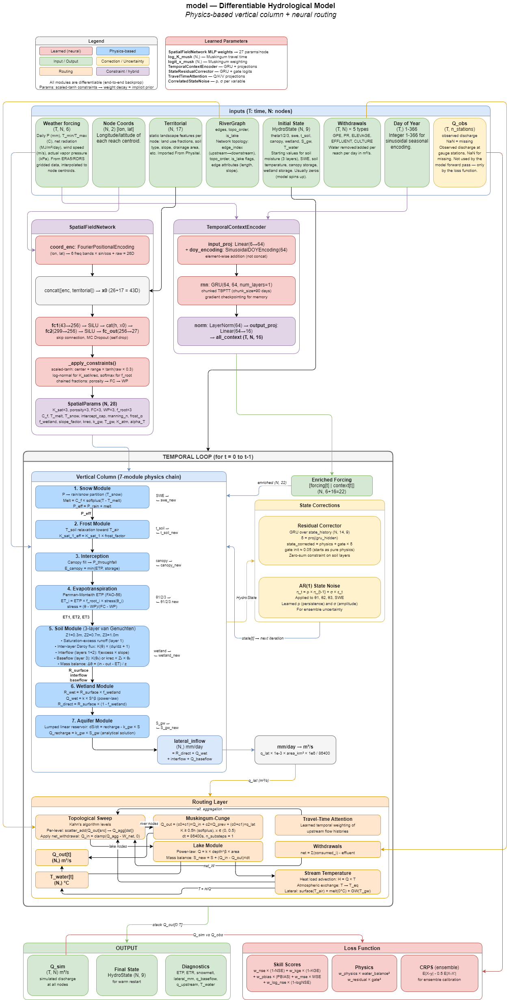

# meandre

Experimental differentiable hydrology modeling with Pytorch and vibe coding.

Experiments on Google Colab

https://colab.research.google.com/drive/1uXWJ-qSkyzHOlEprF62qFUvsJfOir0g2?usp=sharing