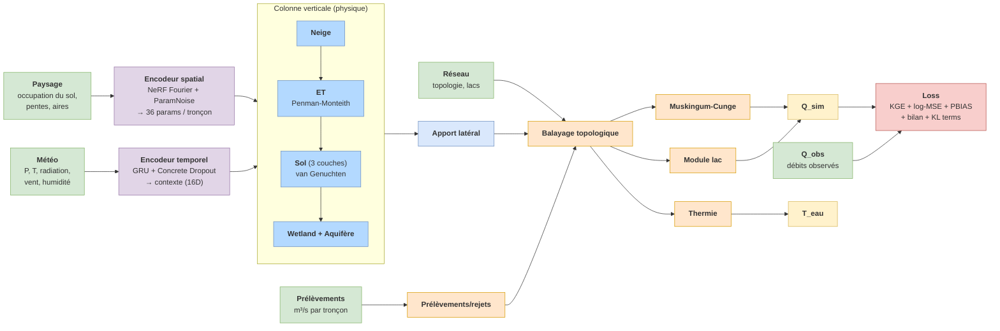

# meandre

Differentiable end-to-end hydrological model in PyTorch.  Reimagines Hydrotel
(INRS-ETE) as a fully differentiable spatio-temporal pipeline trained by
gradient descent on observed streamflow.

## What it does

```
NeRF spatial encoder   →  Temporal context (GRU)  →  Vertical column (physics)
        ↓                          ↓                          ↓
  per-node hydraulic              30-day                 Snow → Frost →
  parameters from              meteorological            Interception → ET (FAO-56)
  (lon, lat, soil, …)            memory                  → Soil (van Genuchten BV3C)
                                                         → Wetland → Aquifer
                                                                ↓
                                  Routing (Muskingum-Cunge, message passing)
                                                                ↓
                                                              Q(t, n)
                                                                ↓
                                                  Loss: KGE + log-MSE + PBIAS
                                                        + physics closure
                                                        + KL ParamNoise
                                                        + KL Concrete Dropout
                                                        + soft prior on params
```

All operations are vectorised over `n_nodes` (river reaches).  Spatial
parameters are produced by an MLP with Fourier positional encoding from
node coordinates and territorial features (soil texture, land cover, slope,
…), so the model **generalises geographically**: a single trained model
covers any basin in the domain.



→ See [`docs/architecture.md`](docs/architecture.md) for the detailed module-level breakdown.

## Why

Operational hydrological models in Quebec (Hydrotel, Raven, GR4J) require
manual calibration per basin and produce point estimates.  meandre:

* **Calibrates by gradient descent** rather than DDS / SCE-UA — converges in
  hours on GPU vs days/weeks of CPU runtime.
* **Generalises across basins** through the NeRF spatial encoder — one
  trained model for the whole Province de Québec instead of one calibration
  per watershed.
* **Quantifies uncertainty** via a two-component stack ("Position B"):
  *ParamNoise* — learnable Gaussian σ on NeRF logits before constraints
  (mass-conserving parametric uncertainty) — and *Concrete Dropout* (Gal,
  Hron & Kendall 2017) on the temporal encoder (epistemic uncertainty over
  the meteorological context). Replaces classical multi-model ensembles
  (Hydrotel + Raven + GR4J) by N forward passes through the same model.
* **Is differentiable end-to-end**, so gradients flow from observed Q back
  to soil hydraulics, snow physics, ET, and routing parameters.

## Status

Tested on the SLSO basin (Saint-Laurent Sud-Ouest, 2889 reaches, 30 stations):

| Metric on dev (2019-2021) | meandre best.pt |
|-----|-----|
| pooled KGE | 0.87 |
| per-station median KGE | 0.78 |
| β (volume) | 0.96 |
| γ (variance) | 0.91 |
| r (timing) | 0.92 |
| KGE_log (baseflow) | 0.92 |

Comparable to per-basin-calibrated Hydrotel.  No manual tuning involved.
Test on held-out 2022-2024 evaluated separately by `eval_test.py`.

## Repository layout

```
meandre/
  data/         Basin cache (DuckDB), forcing extraction, withdrawals loader
  spatial/      NeRF field network, Fourier positional encoding, ParamNoise
  temporal/     GRU context encoder + Concrete Dropout, residual corrector
  vertical/     Snow, frost, interception, ET, soil (3-layer van Genuchten),
                wetland, aquifer
  routing/      RiverGraph, Muskingum-Cunge kinematic wave, message passing,
                lake (Newton-Raphson), stream temperature, withdrawals
  training/     Trainer, HydroLoss, scheduler, run logger, MC uncertainty
  utils/        HydroState, metrics (KGE, NSE, log-NSE, PBIAS, …)
  model.py      HydroModel — top-level orchestrator

notebooks/slso/ SLSO basin config, training script, diagnostics, results
docs/           Architecture diagrams, basin DB schema
tests/          Mirrors meandre/ structure
```

## Quickstart

```bash
# Install
uv sync

# Run SLSO training (from repo root) — uses notebooks/slso/config/slso.toml
python notebooks/slso/slso.py

# Held-out test evaluation on best.pt (CPU, no GPU conflict)
python scripts/eval_test.py

# Full diagnostics (water balance, hydrographs, KGE maps,
#                  MC uncertainty ensemble with Talagrand + PICP)
quarto render notebooks/slso/diagnostics.qmd

# Generate MC uncertainty ensemble (ParamNoise + Concrete Dropout, NetCDF)
python scripts/mc_uncertainty.py
```

## Build a basin from a bounding box

`scripts/bbox_to_basin.py` produces a `basin.duckdb` and (optionally) a
`forcing.nc` directly from open data — **no manual GIS pipeline**.

```powershell
# Basin only (auto-detected outlet on the bbox edge, max-accumulation cell)
python scripts/bbox_to_basin.py `
    --bbox=-71.5,46.55,-71.3,46.75 `
    --output=notebooks/test/basin.duckdb

# Basin + daily forcing (Open-Meteo ERA5 archive, 2000–2024)
python scripts/bbox_to_basin.py `
    --bbox=-73.0,44.5,-69.6,47.7 `
    --output=notebooks/slso/data/slso-od.duckdb `
    --with-forcing --start=2000-01-01 --end=2024-12-31
```

NOTE on PowerShell: values starting with `-` (negative coords) require
the `--bbox=...` syntax (with `=`) to avoid being parsed as new flags.

### Data sources used

| Layer | Source | Resolution | API |
|-------|--------|-----------|-----|
| DEM | Copernicus DEM 30m | 30 m | Planetary Computer (STAC) |
| Land cover | ESA WorldCover 2021 | 10 m | Planetary Computer (STAC) |
| Forest type / wetland | NRCan Annual LC | 30 m | Planetary Computer (STAC) |
| Sand / silt / clay | ISRIC SoilGrids 2.0 | 250 m | SoilGrids REST |
| Permanent water | JRC Global Surface Water | 30 m | Planetary Computer (STAC) |
| LAI | MODIS MOD15A2H | 500 m | Planetary Computer (STAC) |
| Lake polygons (small) | OpenStreetMap | vector | Overpass API |
| River geometry (viz) | OpenStreetMap | vector | Overpass API |
| Daily forcing (P, T) | Open-Meteo ERA5 archive | 0.1° | Open-Meteo HTTP |

### What the pipeline computes

1. **Hydrological conditioning** — pit fill + depression fill + flat resolution (pysheds), D8 flow direction and accumulation
2. **Auto outlet detection** — highest-accumulation cell on the bbox edge (or pass `--outlet=lon,lat` to override)
3. **Sub-catchment delineation** — confluence detection at min_area_km2 threshold (default 1.5 km²)
4. **Topology** — directed edges between sub-catchments + Kahn topological order
5. **Zonal statistics per node** — drainage area, slope, elevation, aspect, land cover fractions, soil texture, LAI
6. **Pedotransfer functions (Saxton-Rawls 2006)** — porosity, theta_fc, theta_wp, Ksat from sand/clay (physical init for NeRF)
7. **Lake detection** — JRC permanent water (>75% occurrence) ∪ OSM water polygons (small lakes/reservoirs)
8. **Forcing** (optional) — daily pr/tasmin/tasmax/sfcWind via Open-Meteo, gridded netCDF compatible with `extract_forcing()`

### Known limitations

* **Discharge observations are not auto-fetched.** `bbox_to_basin` produces the physical model only (basin + forcing). To train, you still need to populate `stations` and `observations` tables in the DuckDB from your hydrometric source (e.g. ECCC HYDAT, Quebec MELCC). See `meandre/data/basin_cache.py` for the schema.
* **Outlet auto-detection** picks the max-acc cell on the bbox *edge* — works for "natural" basins where one large outlet dominates. For composite regions (multiple non-overlapping basins), pass `--outlet` explicitly or supply `basin_mask_gdf` programmatically.
* **Travel time** is hardcoded to 1 day per edge (Muskingum K, x are learned by the NeRF anyway).
* **Open-Meteo ERA5** has known biases over Quebec (orographic precip on Appalachians); meandre's GRU + NeRF are designed to learn around these systematic biases.
* **Daymet not used** — calibrating on Daymet would create a training-vs-inference dataset shift since no real-time Daymet equivalent exists. Open-Meteo ERA5 chosen for consistency with operational use.
* **OSM Overpass instability** — small water polygons and river LineStrings may be unavailable when Overpass mirrors are down. The pipeline degrades gracefully (skips that layer; basin still builds from JRC water + DEM topology).

## Configuration

Per-basin TOML at `notebooks/slso/config/slso.toml`:

* `[paths]` — basin DuckDB, forcing zarr/nc, checkpoint
* `[temporal]` — train / dev / test split (rigorous, no leakage)
* `[model]` — NeRF settings, ParamNoise (spatial) + Concrete Dropout (temporal), residual history
* `[soil]` — z1 (fixed) + per-node bounds for z2, z3, rain_hours
* `[training]` — lr, epochs, chunk_steps (for gradient accumulation),
                 best_metric, prior weight `w_prior`, curriculum epochs
* `[loss]` — weighted combination of KGE / log-MSE / PBIAS / physics-closure

## Documentation

* [Basin DB schema](docs/basin_db_schema.md) — DuckDB tables
* [Architecture](docs/architecture.md) — Mermaid diagrams (overview + detailed) and module status
* [`scripts/bbox_to_basin.py`](scripts/bbox_to_basin.py) — automated bbox → basin.duckdb + forcing.nc pipeline

## Key design choices

* **NeRF parameters with Fourier features** — continuous spatial fields,
  no spatial discontinuities at sub-basin boundaries.
* **3-layer van Genuchten soil** — depths `z2, z3` learned per node,
  `z1` fixed (configurable).  K(θ) and ψ(θ) used directly; ψ clamped to
  -100 m to prevent gradient explosion as Se → 0.
* **Newton-Raphson lake module** — replaces explicit Euler that was
  mass-non-conservative (528 % residual fixed).
* **Eagleson sub-daily infiltration excess** — `rain_hours` per node
  controls effective intensity.
* **Cold content snow physics** — prevents mid-winter melt artefacts.
* **Withdrawals** — surface and groundwater pumping/return flow injected
  per node from monthly site-level parquet (`io-eau-meandre.parquet`),
  snapped to nearest reach.
* **Soft prior regularization** — log-space L2 toward Hydrotel literature
  defaults (Rawls 1982, Hock 2003, FAO-56) prevents overfitting toward
  unphysical parameter regions.

## Training safeguards

* Truncated BPTT every 365 days
* Chunked gradient accumulation every 180 days (empirical sweet spot, fits 8 GB VRAM)
* Divergence rollback if loss > 3× EMA (max 3 rollbacks)
* Cached end-of-train state for fast `_val_epoch` (saves ≈ 50 min/epoch)
* `_val_epoch` does continuous spinup → train → val forward pass for
  honest metric (no protocol shortcut that skipped train period)

## Known limitations

* UQ calibration (PICP ≈ 80 %, Talagrand δ/N ∈ [1, 5]) not yet validated
  on the current Position B stack — to be checked after the fine-tune
  reaches its KGE plateau.
* Residual corrector currently disabled (`enable_residual_epoch = 9999`)
  pending redesign — gate initialization and noise injection at
  activation cause loss spikes.
* Travel-time attention disabled (`enable_travel_epoch = 9999`) for the
  same warm-start instability reason.
* AR(1) state noise is legacy (breaks mass conservation) — superseded by
  ParamNoise and not recommended for new runs.

## Citation / context

Builds on Hydrotel (Fortin et al., INRS-ETE) and recent neural-physics
hybrid literature.
