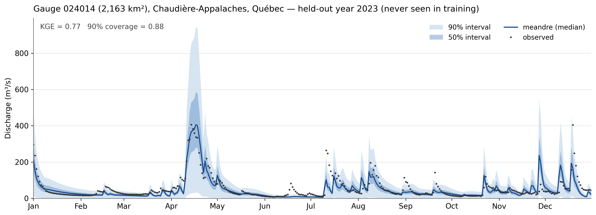

# meandre

> **Research prototype: not production-ready.** Active development happens on
> the [`dev`](../../tree/dev) branch; `main` is a periodic snapshot. Results
> below are intermediate and evolve weekly.

Differentiable end-to-end hydrological model in PyTorch. Reimagines Hydrotel
(INRS-ETE) as a fully differentiable spatio-temporal pipeline trained by
gradient descent on observed streamflow, with a faithful clone of the Hydrotel
vertical physics as its backbone and a NeRF spatial encoder for parameters.

## What it does

```
NeRF spatial encoder (+ z_n latents)   →   Hydrotel column (faithful physics)
        ↓                                          ↓
 37 hydraulic parameters per node        Snow (degree-day modified, regional
 from (lon, lat, territorial feats)      melt anchor) → Frost (Rankinen) →
 + additive per-node random effects      ET (McGuinness / Linacre regional /
                                         Penman / Oudin) → Soil (BV3C2 clone,
                                         3 layers, validated to the decimal
                                         vs Hydrotel C++) → Wetland → Aquifer
                                         → optional hillslope Nash UH
                                                   ↓
                       Routing: Muskingum-Cunge (operator mode, ~25× faster),
                       lakes (learned k/beta), topological message passing
                                                   ↓
                                          Q_sim(t, n)  +  quantile head
                                          (K=6 offsets from the median,
                                          median = Q_sim → KGE preserved)
                                                   ↓
                       Loss: MSE + log-MSE + PBIAS + peak weighting
                       + multi-objective MODIS ET / GRACE TWS
                       + anti-collapse prior on parameter means
```

All operations are vectorised over `n_nodes` (river reaches). Spatial
parameters are produced by an MLP with Fourier positional encoding (isotropic
haversine projection) from node coordinates and territorial features, so the
model generalises geographically. Per-node additive latent codes (`z_n`,
mixed-effects style with L2 shrinkage) capture station-specific corrections in
parameter space.

-> See [`docs/architecture.md`](docs/architecture.md) for the module-level breakdown.

## Why

Operational hydrological models in Quebec require manual calibration per
region and produce point estimates. The operational reference is in fact an
ensemble of 6 equifinal Hydrotel calibrations whose regional rankings are mutually inconsistent. meandre:

* Calibrates by gradient descent: hours on a single 8 GB GPU.
* Learns a continuum of parameters instead of N discrete calibrations
  (identifiability instead of equifinality).
* Quantifies uncertainty with a quantile head (pinball loss, K=6 quantiles
  as offsets from the median) trained on the frozen backbone: the
  deterministic KGE is preserved by construction and coverage is calibrated.
* Reproduces Hydrotel faithfully where it should (BV3C2 soil and Linacre ETP
  validated to the decimal against the C++ 4.3.6 binary on 4780 UHRH), and
  diverges deliberately where it can do better (documented divergences:
  restituting aquifer, hillslope UH, learned lake routing).

## Intermediate results (held-out 2022-2024, never seen in training or selection)

One year of the held-out period at a 2163 km² gauge (SLSO domain), probabilistic
prediction with calibrated quantile intervals:



SLSO basin (2889 reaches, 30-38 stations), CaSR open forcing, PHYSITEL mesh (reproductible mesh production is in progress), against the operational reference (an ensemble of 6 independent Hydrotel
calibrations), on common stations and days:

| Metric | meandre | Hydrotel ensemble (6 members) |
|-----|-----|-----|
| per-station median KGE | **0.689** | 0.560 – 0.673 (all 6 beaten) |
| pooled KGE | 0.798 | - |
| quantile cov_90 / cov_50 | 0.905 / 0.498 | point estimates only |

Province-wide scale-up (15 PHYSITEL regions) is in progress; per-region
held-out medians with the current uniform recipe, before regional anchoring
(the pilot campaign lifted MONT from 0.52 to 0.59; anchors not yet fleet-wide):

| Region (n gauges) | meandre | best Hydrotel member | ensemble median |
|---|---|---|---|
| LABI (1) | **0.79** | 0.74 | 0.65 |
| CNDB (2) | **0.77** | 0.57 | 0.55 |
| CNDD (1) | 0.64 | 0.72 | 0.69 |
| MONT (23) | 0.59 | 0.76 | 0.64 |
| SLNO (27) | 0.59 | 0.82 | 0.79 |
| SAGU (20) | 0.52 | 0.81 | 0.77 |
| OUTV (16) | 0.54 | 0.83 | 0.80 |
| GASP (16) | 0.49 | 0.79 | 0.77 |

The eastern gap is attributed (forcing timing where CaSR assimilates few
stations + ETP model, both with validated fixes); the honest current picture
is: meandre beats the full ensemble where it has been tuned end-to-end (SLSO),
and the regional anchoring recipe to generalize this is under active pilot
testing on `dev`.

Quebec scale-up (15 PHYSITEL regions): infrastructure complete (regional
DuckDB caches, CaSR tiles, corrected forcings, training queue, 6-member
comparator), pilot campaign on MONT/GASP/SAGU documented in
[`reports/RAPPORT_QUEBEC.md`](reports/RAPPORT_QUEBEC.md). Key findings: the
regional calibration of Hydrotel lives in the ETP multiplier and melt
thresholds (both now anchorable per region), freezing the soil field kills the
model (the NeRF needs it to compensate structural divergences), and the
east-of-province gap is part forcing (CaSR assimilation density), part model.

## Forcing

Canonical forcing is CaSR v3.2 (ECCC open reanalysis), self-corrected with no
third-party product:

1. Timing: hourly precipitation aggregated on the local day (UTC-5) to match
   gauge days.
2. Distribution: hourly de-drizzle (< 0.3 mm/h removed).
3. Volume: annual total anchored on the regional water balance
   (observed runoff + regional ETP model).

Scripts: `.runs/slso/build_casr_corrected.py` (SLSO),
`.runs/quebec/build_forcing_region.py` (any region). The correction method is
documented for external use in `notebooks/correction_casr_ouranos.ipynb`.

## Repository layout

```
meandre/
  data/         Basin cache (DuckDB), PHYSITEL loader, gridded forcing,
                Hydrotel regional calibration loaders (soil / Linacre / melt),
                MODIS, GRACE, HYDAT/CEHQ, withdrawals
  spatial/      NeRF field network, Fourier encoding, latent codes z_n
  temporal/     (legacy) GRU context encoder: removed from the active model
  vertical/     HydrotelColumn (orchestrates the hydrotel_clone physics),
                spatial melt modulation, ET modes
  routing/      RiverGraph, Muskingum-Cunge (operator mode), lakes,
                message passing, withdrawals
  training/     Trainer, loss (incl. pinball / quantile), autopilot
  utils/        HydroState, metrics, quantile head
  model.py      HydroModel — top-level orchestrator

hydrotel_clone/ Faithful ports of Hydrotel C++ physics + validation harnesses
                (bv3c2, snow, linacre, mcguinness, milieu_humide, ...)
                validate_*.py compare against the C++ binary output per UHRH
.runs/slso/     SLSO case: configs, training script (slso.py), data builders
.runs/quebec/   Quebec scale-up: region builders, configs, fleet + eval scripts
reports/        experiment_log.md (every run, verdicts), RAPPORT_QUEBEC.md
docs/           Architecture, basin DB schema
tests/          Mirrors meandre/ structure
```

## Quickstart

```bash
uv sync

# SLSO training (from repo root); config chooses forcing/recipe
python .runs/slso/slso.py .runs/slso/config/slso-casr-zn.toml

# Quantile head on a frozen champion (probabilistic calibration)
python .runs/slso/slso.py .runs/slso/config/slso-casr-zn-quantile.toml

# Held-out eval only, reusing the saved checkpoint
MEANDRE_EVAL_ONLY=1 python .runs/slso/slso.py <config.toml>

# Build a Quebec region from its PHYSITEL platform + observations
python .runs/quebec/build_regions.py GASP
python .runs/quebec/build_forcing_region.py GASP

# Compare any trained region against the 6-member Hydrotel ensemble
python .runs/quebec/eval_regions.py GASP

# Tests
pytest tests/ -x -q
```

Hydrotel reference runs (for validation harnesses) use the compiled C++ 4.3.6
binary under WSL: `wsl <repo>/../hydrotel/gcc/hydrotel <PLATFORM>.csv`
(~18 min for a full 5-year regional platform; requires a `hydro/station.sth`,
an empty one is accepted).

## Configuration (TOML per case)

* `[paths]ˋ: basin DuckDB, forcing cache, checkpoint, outputs
* `[temporal]`: strict train / dev / test split (test never touches selection)
* `[model]`: `use_latent_codes` (z_n), `spatial_melt` (NeRF C_f modulates
  melt), `melt_factor_scale` (legacy scalar recipe, ignored when warm-starting
  or when `spatial_melt` is on), lakes, routing mode
* `[et]`: `mode` (`mcguinness` | `linacre` | `penman` | `oudin` |
  `hydro_quebec`); `linacre` requires `linacre_project_dir` (regional platform,
  loads the per-UHRH optimized ETP multiplier)
* `[snow]`: `melt_project_dir`: anchor melt rates AND thresholds on the
  regional Hydrotel calibration (degre_jour_modifie.csv)
* `[soil]`: `hydrotel_calib_dir` anchors the soil on a platform calibration.
  Warning: freezing the soil field has systematically degraded results
  (see reports/experiment_log.md, "loi des ancrages")
* `[training]`: lr, epochs, chunk_steps, tbptt, `best_metric`
  (kge_median recommended; `nll` = pinball in quantile mode), warm_start,
  freeze_* for head-only training, autopilot
* `[loss]`: MSE/log-MSE/PBIAS/peak weights, `w_et`/`w_tws` (MODIS/GRACE
  multi-objective), `nll_distribution = "quantile"` + `quantile_taus`

## Key design rules (learned the hard way)

* Validate any ported physics against its C++ reference on the smallest unit
  before integrating (the soil and Linacre clones match to the decimal; every
  shortcut taken without this rule has failed).
* Pilot before fleet: one contrasted region end-to-end before launching
  multi-region campaigns.
* Anchor regional processes (ETP multiplier, melt thresholds); never freeze
  the fields the NeRF must learn (soil).
* Compare held-out to held-out, against the full 6-member ensemble, on common
  stations and days. Dev metrics are selection metrics, nothing more.
* Only the relative (cross-station) error pattern is stable across climate
  regimes; level corrections learned on the past do not transfer.

## Known limitations / open work

* Winter/spring timing (r) still trails the best regional Hydrotel member on
  agricultural lowlands (MONT) after ETP + melt anchoring; next suspects are
  ice-season routing and snowpack compaction.
* Regulated rivers (Côte-Nord, Saguenay) show the reservoir signature
  (gamma >> 1); no operations module.
* Gauge-poor regions cannot be trained standalone; joint multi-region
  training (shared NeRF, pooled gauges) is the structural answer, not built yet.
* Withdrawals parquet is SLSO-only (zeros elsewhere).
* The GRU temporal encoder and the residual corrector are inactive in the
  current model (kept for checkpoint compatibility).
