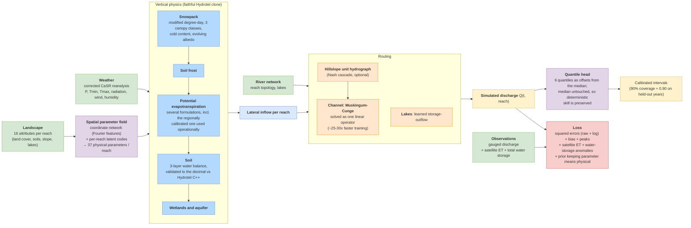

# Meandre: Model Architecture

Updated 2026-07-19. Describes the active pipeline: a NeRF parameter field with
per-node latent codes, a faithful clone of the Hydrotel vertical physics,
channel routing, and a quantile head for probabilistic prediction. Retired
modules (GRU temporal encoder, residual corrector, earlier uncertainty stacks)
are listed at the end for checkpoint compatibility.

## Overview

## Spatial parameter field (`meandre/spatial/field_network.py`)

Instead of calibrating parameters reach by reach, a small MLP maps
(longitude, latitude, landscape attributes) to the 37 physical parameters of
each reach. Coordinates go through Fourier positional encoding after an
isotropic map projection (using raw degrees made the field anisotropic and
collapsed it to near-uniform values, a failure diagnosed in June 2026).
Parameters are constrained to physical ranges by sigmoid or softplus bounds.

Two additions matter in practice:

* Per-reach latent codes: small additive offsets learned per reach with L2
  shrinkage, the mixed-effects idea. They capture what the landscape
  attributes cannot explain and are the best deterministic recipe on held-out
  data so far.
* A prior that pulls the MEAN of each parameter toward literature defaults
  (Rawls soil hydraulics, Hock melt rates, FAO-56) while leaving spatial
  variation free. An earlier variant penalized per-reach deviations and
  collapsed the field; the distinction is essential.

`init_from_literature()` biases the output layer so training starts from
physically plausible values (otherwise saturated conductivity starts about
50x too high and epochs are wasted recovering).

## Vertical physics (`meandre/vertical/hydrotel_column.py` + `hydrotel_clone/`)

The soil-snow-evapotranspiration column is a line-by-line port of the
Hydrotel C++ source (version 4.3.6), and each ported piece is validated
against the output of the compiled binary on every computational unit before
being used: the 3-layer soil balance and the Linacre evapotranspiration match
the C++ to the decimal over thousands of units and multiple years. This
validation discipline is the backbone of the project: when meandre differs
from Hydrotel, it is by choice, not by accident.

* Snowpack: modified degree-day with three canopy classes, cold content,
  liquid water retention and an evolving albedo. Melt rates and, critically,
  melt temperature thresholds can be anchored on the regional operational
  calibration; a NeRF output then modulates the anchored rates spatially.
* Potential evapotranspiration: several formulations are available
  (McGuinness, Penman-Monteith, Oudin, and the Linacre variant used by the
  operational model). The operational calibration multiplies Linacre by an
  optimized factor of roughly 0.4 to 0.5; loading that factor per reach
  turned out to be one of the two keys to matching operational volumes.
* Soil: three layers with the Hydrotel BV3C conceptual scheme (infiltration,
  bidirectional inter-layer exchange, lateral interflow, recharge).
* Deliberate divergences from Hydrotel, each optional and documented: an
  aquifer that returns baseflow (Hydrotel loses recharge irreversibly), a
  hillslope unit hydrograph, saturation-excess runoff, and a growing-season
  crop coefficient.

## Routing (`meandre/routing/`)

Hydrotel routes water in two stages, both with kinematic-wave schemes: a
kinematic wave over the hillslope (which spreads the daily runoff pulse) and
a modified kinematic wave in the channel (essentially pure advection with
little numerical diffusion). meandre replaces this pair with:

* An optional hillslope unit hydrograph (two Nash cascades, one sharp for
  surface runoff, one slow for interflow), playing the role of the hillslope
  kinematic wave: it spreads the lateral inflow before it enters the channel.
* Muskingum-Cunge in the channel. This is a finite-volume form of the
  kinematic wave whose numerical diffusion is matched to the physical
  diffusivity, with travel time K and weighting x learned per reach (K
  bounded 4 to 48 hours, x bounded 0.01 to 0.49, four sub-steps). At the
  pure-advection end of its range it recovers the behaviour of the modified
  kinematic wave used operationally.
* Because the routing is linear in the inflows once K and x are fixed, the
  whole simulation can be solved as one triangular linear system instead of
  a day-by-day Python loop ("operator mode"): training epochs went from about
  17 minutes to about 40 seconds, with identical results and exact gradients.

Lakes get a learned storage-outflow relation per lake reach (removing them
costs about 0.2 KGE on lake-rich basins). Water withdrawals are injected per
reach where data exists.

## Probabilistic head (`meandre/utils/quantile_head.py`)

Six quantiles (5% to 95%) are predicted as offsets from the simulated
discharge, which remains the median. The head is trained with the pinball
loss on a frozen backbone, so the deterministic skill is preserved by
construction and only the interval widths are learned. On held-out years the
90% interval covers 90.5% of observations and the 50% interval 49.8%,
which is the calibration a forecasting user actually needs.

## Losses (`meandre/training/loss.py`)

* Discharge: squared error on raw and log flows, a bias term, and a peak
  weighting (all usable with chunked gradient accumulation).
* Auxiliary observations: satellite evapotranspiration (8-day MODIS) and
  monthly total water storage anomalies (GRACE). These two constraints
  reopened the vertical water partition when discharge alone left deep-soil
  fluxes collapsed near zero.
* The anti-collapse parameter prior described above.

## Training (`meandre/training/trainer.py`)

Truncated backpropagation through time (yearly), chunked gradient
accumulation (180 days, fits an 8 GB GPU), divergence rollback to the best
checkpoint, warm spinup caching, and an autopilot that cuts the learning rate
on plateaus and restarts from the best checkpoint when the volume or
variability ratios drift.

## Regional anchoring (province-wide scale-up)

The operational reference is not one model but an ensemble of six
calibrations of the same Hydrotel physics (one using Linacre
evapotranspiration, five using McGuinness). Their regional skill rankings are
mutually inconsistent, a textbook case of equifinality, which is precisely
the argument for learning one continuous parameter field instead.

Dissecting those calibrations showed where the regional knowledge actually
lives, and what meandre can borrow:

| Calibrated piece | Anchor in meandre | Verdict from pilots |
|---|---|---|
| Evapotranspiration multiplier (about 0.4 to 0.5, per unit) | `[et].mode = "linacre"` + platform directory | fixes the volume bias |
| Melt rates and temperature thresholds | `[snow].melt_project_dir` | fixes winter and spring timing |
| Soil parameters | `[soil].hydrotel_calib_dir` | do not use: freezing the soil field consistently breaks the model, because the parameter field needs the soil dimensions to compensate meandre's deliberate structural differences |

## Retired modules (kept for checkpoint compatibility, inactive)

* GRU temporal encoder (inert on the physics path, removed June 2026).
* Residual corrector (disabled, pending redesign).
* Earlier uncertainty stacks (parameter noise, Concrete Dropout, a
  heteroscedastic sigma head), superseded by the quantile head.
