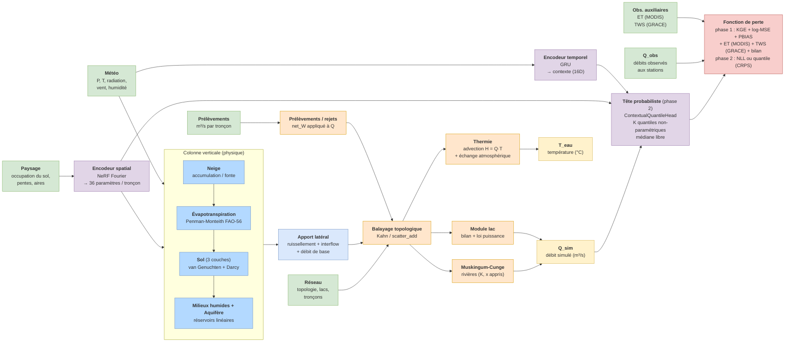
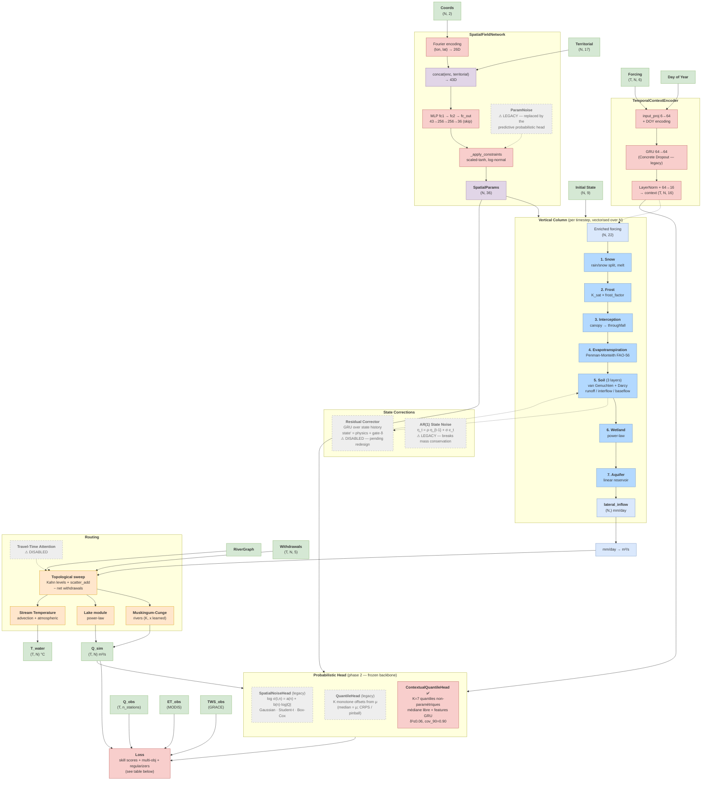

# Meandre — Model Architecture

Two views of the model:
- **Overview** (FR) — high-level dataflow for stakeholders / presentations
- **Detailed** (EN) — module-level breakdown for developers

Both diagrams are Mermaid blocks: they render natively on GitHub, GitLab, and most Markdown viewers (VS Code requires the *Markdown Preview Mermaid Support* extension).

---

## Overview / Vue d'ensemble

---

## Detailed architecture

**Other outputs** (not shown above to keep the diagram compact):
- `final_state` — `HydroState (N, 9)` for warm restart
- `diagnostics` — ETP, ETR, snowmelt, q_baseflow, q_upstream, T_water (per timestep)

---

## Module status

| Module | Status | Notes |
|---|---|---|
| Snow / Frost / Interception / ET / Soil / Wetland / Aquifer | ✅ Active | core physics chain |
| Routing (Muskingum-Cunge, Lake, Stream Temperature) | ✅ Active | |
| SpatialFieldNetwork (NeRF) | ✅ Active | Fourier + MLP → 36 params; constrained by ET/TWS multi-obj |
| TemporalContextEncoder (GRU) | ✅ Active | Concrete Dropout now legacy (Position B) |
| Probabilistic head (NoiseHead / QuantileHead) | ✅ Active | phase 2, frozen backbone — heteroscedastic σ or quantiles |
| Multi-objective (MODIS ET, GRACE TWS) | ✅ Active | phase 1 — decollapses `f_vert`, identifiability |
| Withdrawals | ✅ Active | rebuilt 2026-05-01 from `io-eau-meandre.parquet` |
| Residual Corrector | ⚠️ **Disabled** | pending redesign — gate never trained, noise injection at activation |
| Travel-Time Attention | ⚠️ **Disabled** | random-init weights crash forward; needs warmup gate |
| ParamNoise (Position B) | ⚠️ **Legacy** | ensemble stack abandoned 2026-05-11 → predictive probabilistic head |
| Concrete Dropout (Position B) | ⚠️ **Legacy** | idem |
| AR(1) State Noise | ⚠️ **Legacy** | breaks mass conservation |

## Probabilistic prediction (two-phase)

The ensemble-style "Position B" stack (ParamNoise + Concrete Dropout, sampled at inference) was **abandoned on 2026-05-11** in favour of a **predictive probabilistic head** trained in two phases:

1. **Phase 1 — backbone (deterministic, multi-objective).** Train physics + spatial/temporal encoders against discharge **and** auxiliary observations: MODIS ET (`w_et`) and GRACE TWS (`w_tws`). The multi-objective signal lifts the equifinality that otherwise collapses the deep-soil flux `f_vert`, restoring parameter identifiability.
2. **Phase 2 — uncertainty (frozen backbone).** Freeze the backbone and train *only* a probabilistic head on top of `μ = Q_sim`:
   - **`SpatialNoiseHead`** — per-node `log σ(t,n) = a(n) + b(n)·log(|Q|+ε)`, fit by heteroscedastic NLL (`w_nll`). Distribution selectable: Gaussian, **Student-t** (heavy tails, learned ν), Box-Cox or log-normal.
   - **`QuantileHead`** — per-node monotone offsets `δ_τ` from the median (`μ`), so `q_τ = μ + δ_τ`; fit by pinball / CRPS (`w_quantile`). The median stays `= μ`, preserving the phase-1 KGE.

## Loss components

Weights are config-driven (TOML `[loss]`); below are representative values from the SLSO runs.

**Phase 1 — backbone (`slso.toml` + multi-obj overrides):**

| Term | Weight | Chunk-safe | Purpose |
|---|---:|:---:|---|
| `w_kge` | 1.0 | ⚠️ approx | targets β, r, γ directly |
| `w_log_mse` | 0.3 | ✅ | baseflow emphasis |
| `w_pbias` | 0.1 | ✅ | volumetric balance |
| `w_mse` | 0.1 | ✅ | overall fit |
| `w_et` | 0.1 | ✅ | MODIS ET match (multi-obj) |
| `w_tws` | 0.3 | ✅ | GRACE TWS, z-scored (multi-obj) — drives `f_vert` |
| `w_physics` | 0.01 | ✅ | water-balance closure (P − ET − Q − ΔS) |
| `w_residual` | 0.01 | ✅ | L2 on corrector gate (kept small) |
| `w_nse`, `w_log_nse`, `w_nrmse` | 0.0 | ❌ | NOT chunk-safe — disabled when chunk_steps > 0 |

**Phase 2 — probabilistic (frozen backbone), pick one driver:**

| Term | Weight | Purpose |
|---|---:|---|
| `w_nll` | 1.0 | heteroscedastic NLL (`nll_distribution` = normal / student-t / box-cox) |
| `w_quantile` | 1.0 | multi-τ pinball / CRPS (alternative to NLL) |
| `w_nll_et`, `w_nll_swe` | 0.0 | optional NLL on ET / SWE auxiliary channels |
| `w_peak` | 0.0 | optional peak weighting (climatological Q_p75 threshold) |

## Learned parameters summary

- **SpatialFieldNetwork MLP** weights → 36 params per node (soil hydraulics ×12, snow ×3, ET ×2, routing ×2, etc.)
- **TemporalContextEncoder** GRU + projections (Concrete Dropout `logit_p` — legacy)
- **SpatialNoiseHead** per-node `(a, b)` MLP + `log_df` (ν, Student-t) *(phase 2)*
- **QuantileHead** per-node `(a_τ, b_τ)` MLP *(phase 2)*
- **ParamNoise** `log_sigma` per param *(legacy)*
- **StateResidualCorrector** GRU + gate logits *(disabled)*
- **TravelTimeAttention** Q/K/V projections *(disabled)*
- **CorrelatedStateNoise** ρ, σ per state variable *(legacy)*
