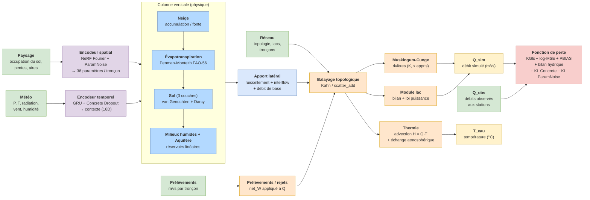
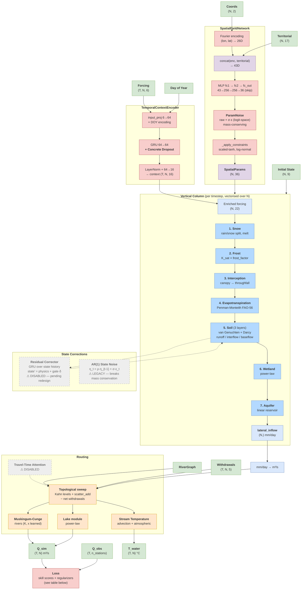

# Meandre — Model Architecture

Two views of the model:
- **Overview** (FR) — high-level dataflow for stakeholders / presentations
- **Detailed** (EN) — module-level breakdown for developers

Both diagrams are Mermaid blocks: they render natively on GitHub, GitLab, and most Markdown viewers (VS Code requires the *Markdown Preview Mermaid Support* extension).

---

## Overview / Vue d'ensemble

---

## Detailed architecture

**Other outputs** (not shown above to keep the diagram compact):
- `final_state` — `HydroState (N, 9)` for warm restart
- `diagnostics` — ETP, ETR, snowmelt, q_baseflow, q_upstream, T_water (per timestep)

---

## Module status

| Module | Status | Notes |
|---|---|---|
| Snow / Frost / Interception / ET / Soil / Wetland / Aquifer | ✅ Active | core physics chain |
| Routing (Muskingum-Cunge, Lake, Stream Temperature) | ✅ Active | |
| SpatialFieldNetwork (NeRF) | ✅ Active | with ParamNoise (Position B) |
| TemporalContextEncoder (GRU) | ✅ Active | with Concrete Dropout (Position B) |
| Withdrawals | ✅ Active | rebuilt 2026-05-01 from `io-eau-meandre.parquet` |
| Residual Corrector | ⚠️ **Disabled** | pending redesign — gate never trained, noise injection at activation |
| Travel-Time Attention | ⚠️ **Disabled** | random-init weights crash forward; needs warmup gate |
| AR(1) State Noise | ⚠️ **Legacy** | breaks mass conservation; replaced by ParamNoise |

## Position B uncertainty stack

Two complementary noise injections, both differentiable, combined at inference:

- **ParamNoise** on `SpatialFieldNetwork`: Gaussian σ injected on `fc_out` logits BEFORE constraints → mass-conserving (constraints bound perturbed params within physical ranges). Each ensemble member = a coherent bounded param set, analogous to an alternative Hydrotel calibration.
- **Concrete Dropout** on `TemporalContextEncoder`: learned dropout rate (Gal et al. 2017) over the GRU context → epistemic uncertainty on the meteorological-context interpretation.

At inference, [scripts/mc_uncertainty.py](../scripts/mc_uncertainty.py) combines `frozen_param_noise(model, seed) ∘ frozen_dropout(model, seed)` to sample N coherent ensemble members.

## Loss components (current weights)

| Term | Weight | Chunk-safe | Purpose |
|---|---:|:---:|---|
| `w_kge` | 1.0 | ⚠️ approx | targets β, r, γ directly |
| `w_log_mse` | 0.3 | ✅ | baseflow emphasis |
| `w_pbias` | 0.1 | ✅ | volumetric balance |
| `w_mse` | 0.1 | ✅ | overall fit |
| `w_physics` | 0.01 | ✅ | water-balance closure (P − ET − Q − ΔS) |
| `w_prior` | 0.005 | ✅ | log-space pull toward literature defaults |
| `w_param_noise_kl` | 0.1 | ✅ | log_sigma → log(target=0.05) |
| `w_concrete_kl` | 0.1 | ✅ | Gal 2017 KL |
| `w_residual` | 0.01 | ✅ | L2 on corrector gate (kept small) |
| `w_nse`, `w_log_nse`, `w_nrmse` | 0.0 | ❌ | NOT chunk-safe — disabled when chunk_steps > 0 |

## Learned parameters summary

- **SpatialFieldNetwork MLP** weights → 36 params per node (soil hydraulics ×12, snow ×3, ET ×2, routing ×2, etc.)
- **ParamNoise** `log_sigma` (per param)
- **TemporalContextEncoder** GRU + projections + Concrete Dropout `logit_p`
- **StateResidualCorrector** GRU + gate logits *(disabled)*
- **TravelTimeAttention** Q/K/V projections *(disabled)*
- **CorrelatedStateNoise** ρ, σ per state variable *(legacy)*
