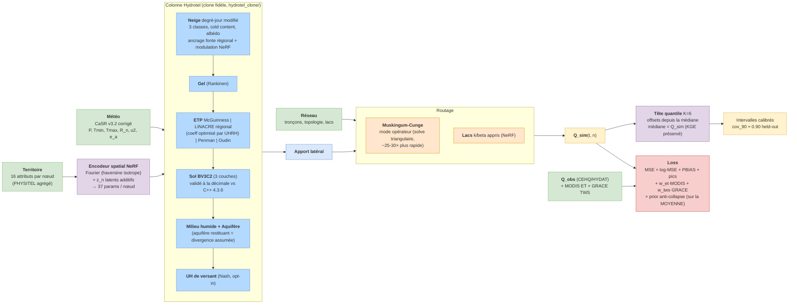

# Meandre — Model Architecture

Updated 2026-07-18. Reflects the current active pipeline: NeRF + z_n latents,
faithful Hydrotel column (hydrotel_clone), operator routing, quantile head.
Legacy modules (GRU temporal encoder, residual corrector, ParamNoise /
Concrete Dropout) are retired and only mentioned for checkpoint compatibility.

## Overview

## Modules

### Spatial encoder (`meandre/spatial/field_network.py`)
* MLP with Fourier positional encoding; coordinates projected isotropically
  (haversine) before encoding — the raw-degrees anisotropy caused the NeRF
  collapse documented in June 2026.
* Outputs 37 constrained parameters per node (sigmoid/softplus bounds), incl.
  soil hydraulics, Muskingum K/x, melt factor C_f, K_c, lake k/beta.
* `init_from_literature()` biases the output head toward public defaults
  (Rawls 1982, Hock 2003, Chow 1959, FAO-56).
* Optional per-node latent codes `z_n` (`use_latent_codes`, mode additive):
  mixed-effects offsets with L2 shrinkage; the best held-out deterministic
  recipe on SLSO.
* Anti-collapse prior: L2 on the deviation of the parameter MEAN from its
  literature target (per-parameter), never on per-node deviations (that
  variant collapsed the field).

### Hydrotel column (`meandre/vertical/hydrotel_column.py` + `hydrotel_clone/`)
* Faithful ports from the C++ 4.3.6 source, each validated per-UHRH against
  the binary: BV3C2 soil (RMSE ~1e-3 mm/day on 4780 MONT UHRH), snow
  degree-day modified, Linacre ETP (exact), milieu humide isolé.
* ET modes: `mcguinness` (default), `linacre` (regional: per-UHRH optimized
  multiplier from the platform's `linacre.csv`, aggregated UHRH→troncon),
  `penman`, `oudin`, `hydro_quebec`.
* Melt: class melt factors; optional regional anchor
  (`[snow].melt_project_dir`) loads calibrated rates AND thresholds from
  `degre_jour_modifie.csv`; `spatial_melt` lets the NeRF C_f modulate the
  anchored rates multiplicatively (clamped 0.15–1.8 around C_f/4.5).
* Deliberate divergences from Hydrotel (documented, opt-in): restituting
  aquifer (Hydrotel leaks recharge irreversibly), hillslope Nash UH,
  VSA saturation runoff, phenology modulator (K_c via GDD).

### Routing (`meandre/routing/`)
* Muskingum-Cunge, K∈[4,48] h, x∈[0.01,0.49]; operator mode solves the
  routing as a triangular system (epoch 17 min → 40 s) with validated
  gradients; message passing follows the topological sort.
* Lakes: learned k/beta per lake node (NeRF outputs); proven indispensable
  (−0.21 KGE without).
* Withdrawals injected per node when available (SLSO parquet; zeros elsewhere).

### Probabilistic head (`meandre/utils/quantile_head.py`)
* K=6 quantiles (0.05…0.95) as offsets from the median; median = Q_sim so the
  deterministic skill is preserved by construction.
* Trained with pinball loss on the FROZEN backbone (warm start, freeze_*),
  `best_metric = "nll"`.
* Held-out calibration on SLSO: cov_90 = 0.905, cov_50 = 0.498.
* Supersedes the 2026-05 "Position B" stack (ParamNoise + Concrete Dropout,
  deprecated) and the sigma noise head (whose coverage block in the held-out
  report is obsolete in quantile mode — read the "quantile" lines).

### Losses (`meandre/training/loss.py`)
* Chunk-safe deterministic set: MSE + log-MSE + PBIAS (+ peak weighting).
* Multi-objective: MODIS MOD16A2GF 8-day ET (`w_et`) and GRACE TWS monthly
  anomalies (`w_tws`) — proven to de-collapse the vertical partition
  (f_vert ×6-8) and lift val KGE.
* Quantile: pinball on K quantiles (`nll_distribution = "quantile"`).
* Timing-tolerant MSE available for experiments (NaN-safe).

### Trainer (`meandre/training/trainer.py`)
* TBPTT (365 d), chunked accumulation (180 d, 8 GB VRAM), divergence
  rollback, warm spinup cache.
* Autopilot: LR plateau cuts + smart restart (reload best + LR cut) gated on
  regression AND beta/gamma drift.
* Warm-start traps handled: `melt_factor_scale` is never re-applied on a
  warm-started checkpoint (double application bug, fixed 2026-07-13).

## Regional anchoring (Quebec scale-up)

The Hydrotel operational reference is an ensemble of 6 calibrations (LN24HA
Linacre + 5 MG24Hx McGuinness) sharing the same physics. Their regional skill
rankings are mutually inconsistent (equifinality). What actually encodes the
calibration:

| Piece | File in platform | Anchorable in meandre |
|---|---|---|
| ETP multiplier (~0.4–0.5, per UHRH) | `linacre.csv` / `etp-mc-guiness.csv` | `[et].mode="linacre"` + `linacre_project_dir` |
| Melt rates and thresholds | `degre_jour_modifie.csv` | `[snow].melt_project_dir` |
| Soil (uniform in LN; member-specific in MG24HK) | `bv3c.csv` | `[soil].hydrotel_calib_dir` — DO NOT: freezing the soil field consistently breaks the model |

Law of anchors (6 pilots, MONT): anchor scalar regional processes, keep the
NeRF free on the fields it must learn.

## Legacy (kept for checkpoint compatibility, inactive)

* GRU temporal encoder (removed 2026-06-09; inert on the physics path).
* Residual corrector (disabled; pending redesign).
* ParamNoise / Concrete Dropout / sigma noise head (superseded by the
  quantile head).
* Travel-time attention (off).
