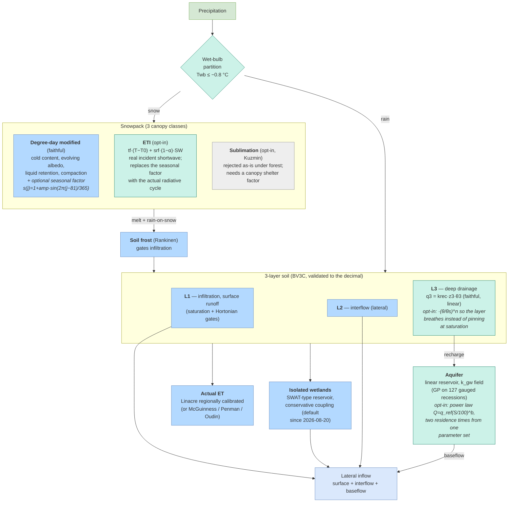
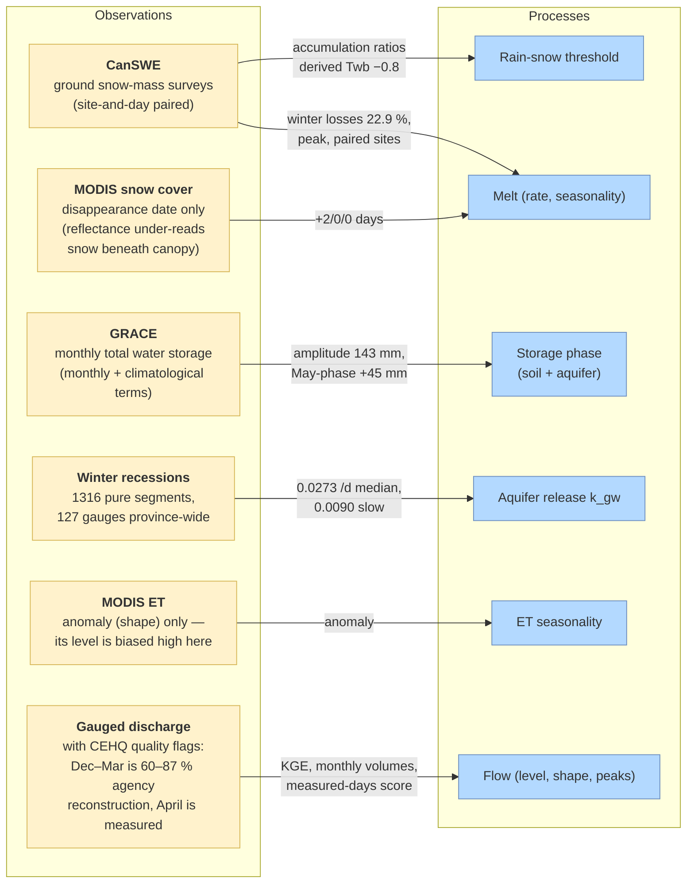

# Meandre: Model Architecture

Updated 2026-08-24, at the 1.0 release-candidate stage. Describes the active pipeline: a NeRF parameter field with per-node latent codes, a faithful clone of the Hydrotel vertical physics extended by opt-in modernized processes, channel routing, and a quantile head for probabilistic prediction. Retired modules (GRU temporal encoder, residual corrector, earlier uncertainty stacks) are listed at the end for checkpoint compatibility.

The design principle that structures everything below: reproduce first, then modernize piece by piece. Every ported piece was validated against the compiled Hydrotel binary before use, every modernized process is opt-in with bit-exact fidelity when disabled, and every process is judged against its own observable, not against discharge alone.

## Overview

```mermaid
flowchart LR
    Met["<b>Weather</b><br/>corrected CaSR reanalysis<br/>P, Tmin, Tmax, net radiation,<br/>wind, vapour pressure<br/>+ incident shortwave (ETI)"]:::input
    Pay["<b>Landscape</b><br/>16 attributes per reach<br/>(land cover, soils, slope, lakes)"]:::input
    Net["<b>River network</b><br/>reach topology, lakes,<br/>withdrawals and returns"]:::input

    Pay --> SE["<b>Spatial parameter field</b><br/>coordinate network (Fourier features)<br/>+ per-reach latent codes<br/>→ 38 physical parameters / reach<br/>(incl. deep drainage krec,<br/>mean anchored on literature)"]:::neural
    Met --> Split["<b>Rain-snow partition</b><br/>on WET-BULB temperature<br/>one threshold, no regional knob"]:::modern
    Split --> VC
    SE --> VC

    subgraph VC["Vertical physics (faithful clone + opt-in processes)"]
        direction TB
        Snow["<b>Snowpack</b><br/>degree-day modified or ETI<br/>(real radiation)"]:::physics
        Sol["<b>3-layer soil</b> (BV3C)<br/>+ frost, ET, wetlands"]:::physics
        Aqu["<b>Restituting aquifer</b><br/>recharge = learned krec field"]:::modern
        Snow --> Sol --> Aqu
    end

    VC --> Lat["<b>Lateral inflow per reach</b>"]:::flow
    Net --> Route
    Lat --> Route

    subgraph Route["Routing"]
        direction TB
        Musk["<b>Muskingum-Cunge channel</b><br/>solved as one linear operator"]:::routing
        Lake["<b>Lakes</b>: learned storage-outflow"]:::routing
    end

    Route --> Qsim["<b>Simulated discharge</b> Q(t, reach)"]:::output
    Qsim --> QH["<b>Quantile head</b><br/>6 quantiles as offsets from the median;<br/>median untouched, deterministic<br/>skill preserved by construction"]:::neural
    QH --> Qint["Calibrated predictive intervals"]:::output

    classDef input fill:#d5e8d4,stroke:#82b366
    classDef neural fill:#e1d5e7,stroke:#9673a6
    classDef physics fill:#b3d9ff,stroke:#6c8ebf
    classDef modern fill:#ccf2e8,stroke:#2e8b74
    classDef flow fill:#dae8fc,stroke:#6c8ebf
    classDef routing fill:#ffe6cc,stroke:#d79b00
    classDef output fill:#fff2cc,stroke:#d6b656
```

Green-teal boxes are the modernized, opt-in processes added in August 2026; blue boxes are the faithful Hydrotel clone; purple boxes are the learned components.

## The vertical column in detail

```mermaid
flowchart TB
    P["Precipitation"]:::input --> WB{"Wet-bulb<br/>partition<br/>Twb ≤ −0.8 °C"}:::modern
    WB -->|snow| SN
    WB -->|rain| SOIL

    subgraph SN["Snowpack (3 canopy classes)"]
        direction TB
        DD["<b>Degree-day modified</b> (faithful)<br/>cold content, evolving albedo,<br/>liquid retention, compaction<br/><i>+ optional seasonal factor</i><br/><i>s(j)=1+amp·sin(2π(j−81)/365)</i>"]:::physics
        ETI["<b>ETI</b> (opt-in)<br/>tf·(T−T0) + srf·(1−α)·SW<br/>real incident shortwave;<br/>replaces the seasonal factor<br/>with the actual radiative cycle"]:::modern
        SUB["<b>Sublimation</b> (opt-in, Kuzmin)<br/>rejected as-is under forest;<br/>needs a canopy shelter factor"]:::modernoff
    end

    SN -->|melt + rain-on-snow| FR["<b>Soil frost</b> (Rankinen)<br/>gates infiltration"]:::physics
    FR --> SOIL

    subgraph SOIL["3-layer soil (BV3C, validated to the decimal)"]
        direction TB
        L1["<b>L1</b> — infiltration, surface runoff<br/>(saturation + Hortonian gates)"]:::physics
        L2["<b>L2</b> — interflow (lateral)"]:::physics
        L3["<b>L3</b> — deep drainage<br/>q3 = krec·z3·θ3 (faithful, linear)<br/><i>opt-in: ·(θ/θs)^n so the layer<br/>breathes instead of pinning<br/>at saturation</i>"]:::modern
    end

    SOIL --> ETR["<b>Actual ET</b><br/>Linacre regionally calibrated<br/>(or McGuinness / Penman / Oudin)"]:::physics
    SOIL --> WET["<b>Isolated wetlands</b><br/>SWAT-type reservoir,<br/>conservative coupling (default<br/>since 2026-08-20)"]:::physics
    L3 -->|recharge| GW["<b>Aquifer</b><br/>linear reservoir, k_gw field<br/>(GP on 127 gauged recessions)<br/><i>opt-in: power law Q=q_ref(S/100)^b,<br/>two residence times from one<br/>parameter set</i>"]:::modern
    GW -->|baseflow| OUT["Lateral inflow<br/>surface + interflow + baseflow"]:::flow
    L1 --> OUT
    L2 --> OUT
    WET --> OUT

    classDef input fill:#d5e8d4,stroke:#82b366
    classDef physics fill:#b3d9ff,stroke:#6c8ebf
    classDef modern fill:#ccf2e8,stroke:#2e8b74
    classDef modernoff fill:#eeeeee,stroke:#999999
    classDef flow fill:#dae8fc,stroke:#6c8ebf
```

Every opt-in process defaults to the faithful behaviour, locked by bit-exact tests: the per-unit validation against the Hydrotel binary remains the foundation regardless of which extensions a run enables.

## The identifiability map: which observation judges which process

This is the operating principle behind the August 2026 campaign. Discharge alone cannot identify the internal water partition (a model reaching KGE 0.79 with zero groundwater proved it); each process therefore answers to an observation that measures it directly, and the loss terms are scaled to the noise of the quantity actually compared (a 21-year climatological bias is judged against the climatology's uncertainty, not a single month's).

```mermaid
flowchart LR
    subgraph OBS["Observations"]
        CANSWE["<b>CanSWE</b><br/>ground snow-mass surveys<br/>(site-and-day paired)"]:::obs
        MOD10["<b>MODIS snow cover</b><br/>disappearance date only<br/>(reflectance under-reads<br/>snow beneath canopy)"]:::obs
        GRACE["<b>GRACE</b><br/>monthly total water storage<br/>(monthly + climatological terms)"]:::obs
        MOD16["<b>MODIS ET</b><br/>anomaly (shape) only —<br/>its level is biased high here"]:::obs
        REC["<b>Winter recessions</b><br/>1316 pure segments,<br/>127 gauges province-wide"]:::obs
        GAUGE["<b>Gauged discharge</b><br/>with CEHQ quality flags:<br/>Dec–Mar is 60–87 % agency<br/>reconstruction, April is measured"]:::obs
    end

    subgraph PROC["Processes"]
        SPLIT2["Rain-snow threshold"]:::proc
        MELT["Melt (rate, seasonality)"]:::proc
        STOR["Storage phase<br/>(soil + aquifer)"]:::proc
        KGW["Aquifer release k_gw"]:::proc
        ETP2["ET seasonality"]:::proc
        FLOW["Flow (level, shape, peaks)"]:::proc
    end

    CANSWE -->|"accumulation ratios<br/>derived Twb −0.8"| SPLIT2
    CANSWE -->|"winter losses 22.9 %,<br/>peak, paired sites"| MELT
    MOD10 -->|"+2/0/0 days"| MELT
    GRACE -->|"amplitude 143 mm,<br/>May-phase +45 mm"| STOR
    REC -->|"0.0273 /d median,<br/>0.0090 slow"| KGW
    MOD16 -->|anomaly| ETP2
    GAUGE -->|"KGE, monthly volumes,<br/>measured-days score"| FLOW

    classDef obs fill:#fff2cc,stroke:#d6b656
    classDef proc fill:#b3d9ff,stroke:#6c8ebf
```

Two hard-won rules travel with this map. First, write down the aggregation unit on both sides before comparing anything (three successive wrong conclusions about snow mass came from mismatched aggregations). Second, when a constraint is rewired, audit the direction it pushes: the MODIS snow-cover constraint, had it ever been active, would have pushed melt earlier, against both GRACE and CanSWE.

## Spatial parameter field (`meandre/spatial/field_network.py`)

A small MLP maps (longitude, latitude, landscape attributes) to 38 physical parameters per reach. Coordinates go through Fourier positional encoding after an isotropic map projection (raw degrees collapsed the field, June 2026). Parameters are bounded by sigmoid/softplus.

* Per-reach latent codes: additive offsets with L2 shrinkage, the mixed-effects idea.
* A prior pulls the MEAN of each parameter toward literature defaults while leaving spatial variation free. The earlier per-reach variant penalized variance and collapsed the field; the distinction is essential and is enforced by tests.
* `krec`, the deep drainage rate, became a field output in August 2026: the Hydrotel calibration strangles it (1.3e-7 m/h, a closed valve) because Hydrotel's recharge is a leak never returned. Learned with its geometric mean anchored at 2e-5 m/h (~34 % baseflow), it produced the project's first non-zero groundwater store and the first improvement of the GRACE storage phase.
* `init_from_literature()` biases the output layer so training starts physical.

## Snow: from regional constants to forcing variables

The 1.0 snow chain replaced two calibrated regional constants with physical variables already present in the forcing, each derived from a mass measurement before any training:

* The rain-snow threshold moved from calibrated air temperature (−2.2 °C in the platforms, a compensation that costs 35 % of the snowpack) to a single wet-bulb threshold (−0.8 °C, Stull 2011 from e_a). One number holds the continental regions; the Gaspé anomaly is traced to the coastal forcing, not to the partition physics (the Hydrotel platform itself needed GASP a degree colder than everyone else).
* Melt seasonality moved from a constant degree-day factor (which encodes the calibration season's energy mix and over-melts in November-December) to either a sinusoidal factor (amplitude 0.5, matching the measured radiative cycle of 0.62 relative amplitude) or, candidate for 1.1, the ETI formulation with real incident shortwave, which needs no seasonal factor at all.

Result on the reference basin, judged site-and-day against CanSWE: accumulation ratios 0.55-0.70 before, 0.93-1.10 after, with winter losses and disappearance dates matching the measured references. A snow-only bench (`.runs/quebec/snow_bench.py`) replays 25 years at the survey-site reaches in seconds per variant, so parameterizations are screened on CPU before any full run.

## Routing (`meandre/routing/`)

* Optional hillslope unit hydrograph (two Nash cascades) before the channel.
* Muskingum-Cunge in the channel, travel time K and weighting x learned per reach (K in 4-48 h, x in 0.01-0.49). Solved as one triangular linear system ("operator mode"): epochs went from ~17 minutes to ~40 seconds with identical results and exact gradients.
* Lakes: learned storage-outflow per lake reach. Withdrawals and returns injected per reach (exact IDTRONCON matching, zero loss); setting them to zero is the renaturalization protocol used for the ministry's mandate.

## Probabilistic head (`meandre/utils/quantile_head.py`)

Six quantiles (5-95 %) as offsets from the simulated discharge, which remains the median. Pinball loss on a frozen backbone: deterministic skill preserved by construction, only interval widths are learned. Reference calibration on held-out years: 90 % interval covering 0.905, 50 % covering 0.498.

## Losses (`meandre/training/loss.py`)

* Discharge: squared errors (raw + log), bias, peak weighting; all chunk-safe.
* Auxiliary constraints at the right noise scale: GRACE monthly (sigma 25 mm) plus a climatological term (sigma 25/sqrt(years), which is what lets a systematic seasonal bias be seen at all); MODIS ET in anomaly mode; an optional CanSWE mass target with representativity filters.
* The anti-collapse prior on parameter means.
* Guard rails, each born from a silent failure: the trainer raises if any auxiliary weight is positive without its target; a family test fails if a TOML training key is silently ignored; loss components are printed weighted per epoch.

## Training (`meandre/training/trainer.py`)

TBPTT (yearly), chunked gradient accumulation (180 days, 8 GB VRAM), divergence rollback, warm spinup caching, autopilot (LR cuts + smart restart on regression-plus-drift), early stopping (patience). The LR ramp toward 5e-4 causes a recoverable mid-training excursion in most runs; the autopilot catches it.

## One recipe, province-wide

The 1.0 release candidate runs twelve regions with a single recipe and no regional knob: wet-bulb threshold, seasonal melt factor, learned krec anchored on literature, aquifer release from the province-wide recession field, ET anomaly at reduced weight, GRACE terms active. The only anchors are the operational platform packages (regional ET multiplier and melt rates), per the anchoring law: anchor scalar processes, never freeze the soil field.

Held-out results against each region's best previous reference: GASP +0.14, MONT +0.07 to +0.20, SLNO +0.05, SAGU and ABIT at parity, and the reference basin above its champion (0.796; 0.809 on measured days, at parity with the operational ensemble's median on those days). First full-scale confirmation of the project's thesis: physics plus a learned field carry the geography better than the regional constants they replace.

## Retired modules (kept for checkpoint compatibility, inactive)

* GRU temporal encoder (inert on the physics path, removed June 2026).
* Residual corrector (disabled, pending redesign).
* Earlier uncertainty stacks (parameter noise, Concrete Dropout, sigma head), superseded by the quantile head.
