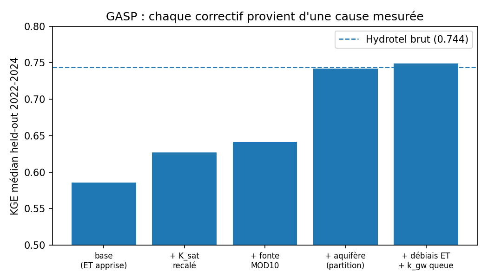

## Le problème et l'idée

Hydrotel, le modèle opérationnel de référence, exige un calage manuel par région, effectué sur des années, et chaque simulation provinciale demande des semaines de calcul sur des serveurs spécialisés. meandre reformule la même physique en PyTorch : chaque étape de calcul (fonte, sol, évapotranspiration, routage) devient une fonction dérivable, donc calibrable par descente de gradient, composable avec des réseaux de neurones, et exécutable sur GPU. Deux conséquences pratiques : le calage devient un entraînement automatique supervisé par les observations, et une simulation provinciale prend des heures sur un poste de travail au lieu de semaines sur une grappe.

Le principe directeur, durci par l'expérience : la structure porte les lois de conservation (l'eau ne se crée ni ne se perd), les composantes apprises ne remplacent que les fermetures empiriques faibles (les formules d'évapotranspiration, les coefficients de fonte), et chaque paramètre est contraint par une observation qui le concerne directement, jamais par le seul débit à l'exutoire qui laisse trop de combinaisons équivalentes (le problème classique d'équifinalité).

La stratégie se déroule en six phases. Les phases 1 et 2 préparent des ingrédients une seule fois, à coût quasi nul. La phase 3 est le seul entraînement lourd. Les phases 4 à 6 déploient.

```{mermaid}
flowchart LR
  P1[Phase 1<br>modules appris<br>hors ligne] --> P3
  P2[Phase 2<br>priors mesurés<br>par région] --> P3[Phase 3<br>entraînement du<br>CHAMPION une région]
  P2 --> P4
  P3 --> P4[Phase 4<br>transfert zero-shot<br>aux 15 régions]
  P4 --> P5[Phase 5<br>fine-tune ciblé<br>où ça décroche]
  P5 --> P6[Phase 6<br>incertitude calibrée<br>+ produits Atlas]
```

## Phase 1 : les modules appris, validés sur banc

Un banc est un dispositif de test isolé : on sort une composante du modèle complet et on l'évalue seule, contre ses propres données, avec un protocole pré-enregistré (métriques et critères de succès fixés avant de lancer). L'intérêt est le coût : un banc tourne en minutes ou en heures, alors qu'un entraînement du modèle complet coûte des heures de GPU par essai. Aucune composante n'entre dans meandre sans avoir gagné son banc.

Exemple central, le module d'évapotranspiration. Plutôt que de choisir entre les formules empiriques (McGuinness, Linacre, Penman), on a entraîné un petit réseau (météo des 90 derniers jours + attributs du territoire, en entrée; évapotranspiration réelle en sortie) directement contre 30 millions d'observations satellitaires MODIS couvrant les 15 régions. Le banc comparait ce réseau aux formules ajustées au mieux, sur des régions jamais vues à l'entraînement et sur des années jamais vues : le réseau gagne partout (R² 0.91 contre 0.77 à 0.82, biais de volume divisé par huit). La fonte de neige suit la même logique : elle est supervisée pendant l'entraînement par les dates de disparition du couvert nival vues par satellite (84 millions d'observations MOD10), plutôt que par des coefficients choisis à la main.

La règle de placement qui garantit la cohérence physique : le module appris fournit une demande (par exemple, la demande évaporative en mm/jour), mais l'eau réellement prélevée passe par le bilan de masse du sol qui la borne à l'eau disponible. Le réseau peut se tromper, il ne peut pas violer la conservation.

## Phase 2 : les priors mesurés, région par région

Un prior est la valeur vers laquelle un paramètre est tiré au départ et pendant l'entraînement. Un prior mesuré est un prior calculé depuis une observation indépendante, plutôt que choisi dans une table de littérature générique. Cette phase ne coûte aucun GPU : ce sont des scripts d'une journée sur les données déjà en base. Trois mesures principales :

La constante de récession. Après une pluie, le débit d'une rivière décroît de façon quasi exponentielle, Q(t) = Q0·exp(−kt); la constante k, ajustée sur les segments de décrue des jauges (figure), mesure la vitesse de vidange des réservoirs souterrains du bassin. Elle donne directement le paramètre de vidange de l'aquifère du modèle (k_gw), région par région : 0.05/jour en Gaspésie (demi-vie de 13 jours), 0.14/jour en Montérégie (rivières agricoles drainées, demi-vie de 5 jours). Cette variabilité régionale mesurée est exactement ce qu'un prior uniforme écraserait.


Le bilan P − Q. Sur un bassin jaugé, la pluie annuelle moins le débit annuel égale l'évapotranspiration plus la variation de stockage (négligeable en moyenne pluriannuelle). C'est une mesure comptable de l'évapotranspiration, indépendante du satellite. En la comparant à MOD16, on découvre que le satellite sur-évapore les plaines agricoles du sud de 17 à 25% (figure). Le ratio bilan/MOD16, calculé par région, devient le débiaisage régional appliqué à la demande du module appris. Leçon apprise à la dure : ce débiaisage doit être appliqué structurellement à la donnée d'entrée, pas comme un prior doux qu'un entraînement sur le climat passé s'empresse de défaire.


Le bilan d'orage. En injectant une pluie synthétique de 50 mm dans le modèle et en mesurant la fraction qui ruisselle (un banc d'impulsion, quelques secondes de calcul), on a découvert que le prior de littérature de la conductivité de surface (K_sat) rendait le sol six fois trop perméable : 17% de ruissellement au lieu des 30 à 50% observés. Le recalage de ce seul prior a fourni le premier grand gain de la série (figure suivante).

## Phase 3 : l'entraînement du champion

Le champion est le modèle entraîné à fond sur une seule région bien instrumentée, avec la recette complète : modules appris de la phase 1, priors mesurés de la phase 2, et la physique enrichie (notamment l'aquifère par nœud : la recharge profonde alimente un réservoir lent par tronçon, vidangé au taux k_gw mesuré, ce qui a résolu d'un coup la fragilité au changement de régime climatique). La Gaspésie (GASP) a servi de champion. Chaque correctif de la figure ci-dessous provient d'une cause identifiée par un test rapide, jamais d'un essai-erreur :



Le verdict est évalué en held-out strict : les années 2022-2024 ne sont jamais vues à l'entraînement ni utilisées pour choisir le modèle, et elles constituent un vrai test hors distribution (étés plus humides de 28%, hivers plus chauds de 1.5 °C). Le champion y fait 0.749 de KGE médian contre 0.744 pour Hydrotel, avec une stabilité entre validation et test équivalente à celle d'Hydrotel, ce qui certifie que les paramètres appris ont un sens physique et non un ajustement au climat passé.

## Phase 4 : le transfert zero-shot

Zero-shot signifie : appliquer le champion à une région où il n'a jamais été entraîné, sans aucun réajustement de ses poids. C'est une pure inférence de quelques minutes. Il faut être précis sur ce qui est hérité d'où : de la phase 3 viennent tous les poids du modèle (le réseau spatial qui prédit les paramètres depuis les attributs du territoire, les modules appris, la colonne physique); de la phase 2 viennent les deux seuls réglages propres à la région d'accueil, son débiaisage d'évapotranspiration (ratio bilan/MOD16) et sa constante de récession mesurée. Rien n'est calé sur les débits de la région d'accueil.

Le test fondateur : le champion gaspésien appliqué au Saguenay obtient 0.706, identique au modèle entraîné sur place (0.705). Le réseau spatial a donc réellement appris une règle attributs-du-territoire vers paramètres qui généralise, ce qui est la thèse scientifique du projet, démontrée par transfert. La carte provinciale complète s'obtient ainsi en une heure et demie d'inférences sur un seul GPU.


Le déploiement a aussi fixé une règle de forçage par classe de région, découverte en corrigeant deux décrochages qui n'étaient pas des échecs de transfert mais des défauts d'intrants : la grille météo krigée s'arrête à 53.3 degrés nord, donc les régions boréales reçoivent la réanalyse corrigée (CaSR) et les régions au sud de la frontière reçoivent l'hybride stations+réanalyse. Diagnostiquer un décrochage commence toujours par les intrants (le beta, composante de volume du KGE, pointe immédiatement une pluie ou une évapotranspiration fausse) avant d'accuser le modèle.

## Phase 5 : le fine-tune ciblé

Un transfert décroche quand le score zero-shot d'une région reste nettement sous ce qu'un entraînement local atteindrait (l'écart se mesure sur les régions où on possède les deux chiffres, et se repère ailleurs par les composantes du KGE : un déficit de volume ou de timing anormal). Exemple : la Montérégie garde 91% de son score local en zero-shot, l'écart venant de sols agricoles drainés sans équivalent en Gaspésie, donc hors du domaine d'apprentissage du champion. Pour ces régions, on repart du champion et on affine quelques epochs sur les jauges locales, en heures. C'est l'équivalent fonctionnel du calage régional d'Hydrotel, automatisé et traçable. Si plusieurs régions d'une même classe décrochent pour la même cause, la parade durable est d'enrichir le champion (entraîner sur deux régions contrastées), pas de multiplier les fine-tunes.

## Phase 6 : l'incertitude et les produits

Sur le modèle déterministe validé se greffe la couche probabiliste, déjà développée et calibrée : une tête de régression par quantiles dont la médiane reste la simulation physique (couverture des intervalles de 90% vérifiée à 0.905 sur années jamais vues), et la propagation d'ensembles météorologiques que la vitesse du modèle rend routinière là où elle est infaisable avec Hydrotel. Les produits en sortent directement : cartes provinciales de débit avec bandes calibrées, scénarios climatiques ou d'occupation du territoire rejoués en une nuit, débits renaturalisés.

## Ce que la preuve de concept établit

Sur les régions pilotes, à météo égale et en évaluation hors distribution : parité ou victoire contre Hydrotel là où le calage manuel d'Hydrotel excellait (GASP 0.749 contre 0.744), record sans calage sur le Saguenay (0.705, l'écart restant à l'ensemble Hydrotel portant la signature de la régulation des barrages, non modélisée des deux côtés), transfert régional démontré, physique certifiée (bilan de masse fermé à 1.3%, paramètres dans leurs plages, évapotranspiration égale au bilan indépendant), et un facteur de vitesse de plusieurs centaines qui change la nature des produits possibles. Chaque chiffre de ce document provient du journal d'expériences du dépôt (reports/experiment_log.md), qui trace la cause, le test et le verdict de chaque décision.
